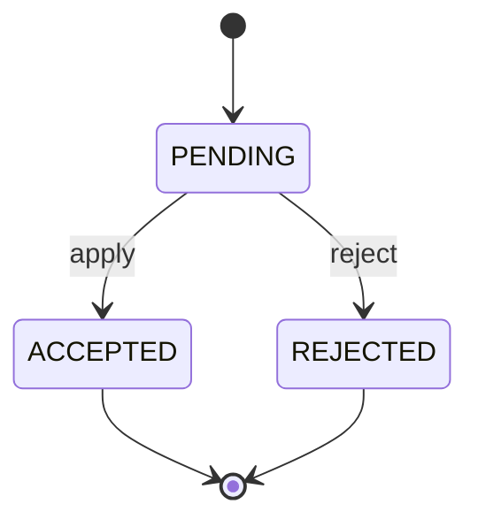

# Proposals Domain

## Overview

The Proposals domain implements the propose/apply workflow pattern for structured, auditable artifact changes with approval tracking.

## Responsibilities

- Define `Proposal` entity for artifact change requests
- Track proposal lifecycle (pending → accepted/rejected)
- Store unified diffs for change visualization
- Maintain audit trail with timestamps and authors

## Domain Models

### Proposal (Entity)

Core domain entity representing a proposed change to an artifact.

**Fields:**
- `id`: Unique proposal identifier
- `project_key`: Project this proposal belongs to
- `target_artifact`: Path to artifact being modified
- `change_type`: Type of change (CREATE, UPDATE, DELETE)
- `diff`: Unified diff of proposed changes
- `rationale`: Justification for the change
- `status`: Current status (PENDING, ACCEPTED, REJECTED)
- `author`: Who created the proposal (default: "system")
- `created_at`: When proposal was created
- `applied_at`: When proposal was accepted and applied (nullable)

**Validation:**
- `change_type` must be valid enum value
- `status` must be valid enum value
- `diff` must be valid unified diff format
- `applied_at` only set when status is ACCEPTED

### ProposalCreate

Request model for creating a proposal (no `id` field, system generates it).

### ProposalStatus Enum

- `PENDING`: Proposal awaiting review
- `ACCEPTED`: Proposal approved and applied
- `REJECTED`: Proposal declined

### Proposal Lifecycle State Diagram



Transition constraints:
- `PENDING`: `applied_at` must be `null`
- `ACCEPTED`: `applied_at` is required
- `REJECTED`: `applied_at` must be `null`

### ChangeType Enum

- `CREATE`: New artifact creation
- `UPDATE`: Existing artifact modification
- `DELETE`: Artifact removal

## Usage

### Creating a Proposal

```python
from apps.api.domain.proposals.models import ProposalCreate, ChangeType

proposal = ProposalCreate(
    project_key="PROJ-001",
    target_artifact="artifacts/requirements.md",
    change_type=ChangeType.UPDATE,
    diff="--- a/requirements.md\n+++ b/requirements.md\n@@ -1,3 +1,4 @@\n...",
    rationale="Updated requirements based on stakeholder feedback",
    author="user@example.com"
)
```

### Accepting a Proposal

```python
from apps.api.domain.proposals.models import ProposalStatus
from datetime import datetime, timezone

proposal.status = ProposalStatus.ACCEPTED
proposal.applied_at = datetime.now(timezone.utc)
```

## Design Notes

- **SRP Compliance**: Proposals focus ONLY on change request lifecycle, not artifact storage
- **Audit Trail**: All proposals have timestamps and authors for compliance
- **Immutability**: Once applied/rejected, proposals should not change status again
- **Diff Format**: Uses standard unified diff for tool compatibility
