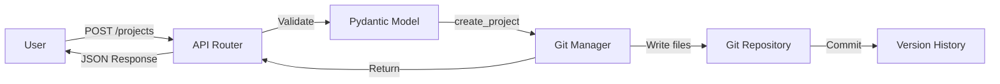
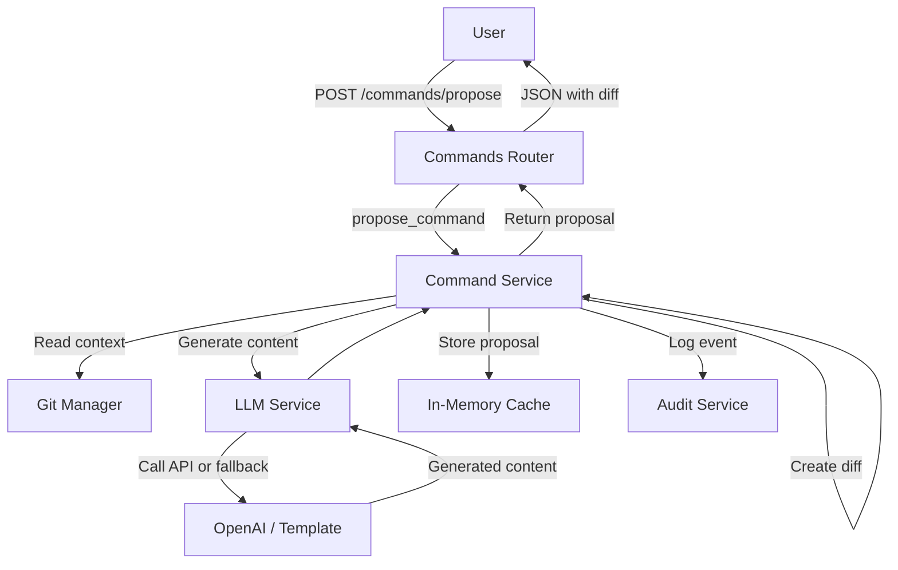

# Contributing to AI-Agent-Framework

**Welcome!** Thank you for considering contributing to the AI-Agent-Framework. This guide will help you get started with development, understand the project structure, and submit high-quality contributions.

## Table of Contents

- [Quick Start for New Contributors](#quick-start-for-new-contributors)
- [Mental Model: Understanding the System](#mental-model-understanding-the-system)
- [Development Setup](#development-setup)
- [Where to Start](#where-to-start)
- [Development Workflow](#development-workflow)
- [Code Standards](#code-standards)
- [Testing Guidelines](#testing-guidelines)
- [Documentation Requirements](#documentation-requirements)
- [Submitting Pull Requests](#submitting-pull-requests)
- [Video Contributions](#video-contributions)
- [Getting Help](#getting-help)

## Quick Start for New Contributors

### 1. Understand the System (30 minutes)

**Start here:**
1. Read [README.md](../README.md) - System overview and features
2. Read [QUICKSTART.md](../QUICKSTART.md) - Setup and basic usage
3. Browse [docs/README.md](README.md) - Documentation index
4. Review [docs/architecture/overview.md](architecture/overview.md) - High-level architecture

**Core concepts to grasp:**
- **Propose/Apply Workflow:** Two-phase command execution (review before commit)
- **Git-Based Storage:** Project documents in separate git repository
- **LLM Integration:** OpenAI-compatible HTTP adapter with fallback
- **ISO 21500 Alignment:** Project management standard compliance

### 2. Set Up Development Environment (10-15 minutes)

```bash
# Clone repository
git clone https://github.com/blecx/AI-Agent-Framework.git
cd AI-Agent-Framework

# Run intelligent setup script
./setup.sh  # Auto-detects Python, creates .venv, installs deps

# Activate virtual environment
source .venv/bin/activate

# Create project docs directory
mkdir projectDocs

# Run API server
cd apps/api
PROJECT_DOCS_PATH=../../projectDocs uvicorn main:app --reload

# API available at: http://localhost:8000
# API docs at: http://localhost:8000/docs
```

**Verify setup:**
```bash
# Check API health
curl http://localhost:8000/health

# Run tests
pytest -q tests/unit
```

### 3. Make Your First Contribution (60 minutes)

**Good first issues:**
- Documentation improvements
- Adding new Jinja2 templates
- Writing tests for existing features
- Fixing typos or broken links
- Adding code comments

**Browse:**
- [Good first issues](https://github.com/blecx/AI-Agent-Framework/labels/good%20first%20issue) on GitHub
- [Documentation TODOs](docs/README.md) in docs/README.md

## Mental Model: Understanding the System

### Architecture Layers

```
┌─────────────────────────────────────┐
│  Client Layer (WebUI, TUI, Client)  │  ← User interaction
├─────────────────────────────────────┤
│  API Layer (FastAPI Routers)        │  ← REST endpoints
├─────────────────────────────────────┤
│  Service Layer (Business Logic)     │  ← Orchestration
├─────────────────────────────────────┤
│  Storage Layer (Git, Templates)     │  ← Persistence
└─────────────────────────────────────┘
```

**Key Principle:** Clear separation of concerns. Each layer has specific responsibilities and doesn't bypass lower layers.

### Data Flow: Create Project



### Data Flow: Propose Command



### Key Concepts

#### 1. Propose/Apply Pattern

**Why?** Allows users to review AI-generated changes before committing.

**Flow:**
1. **Propose:** Generate changes, create diff, return proposal ID
2. **Review:** User views diff in UI
3. **Apply:** Commit changes to git using proposal ID

**Code Location:** `apps/api/services/command_service.py`

#### 2. Git-Based Storage

**Why?** Full version history, branch/merge capability, familiar tooling.

**Structure:**
```
projectDocs/
└── PROJ001/
    ├── project.json          # Project metadata
    ├── artifacts/            # ISO 21500 artifacts
    ├── governance/           # Governance data
    ├── raid/                 # RAID register
    └── events/               # Audit logs (NDJSON)
```

**Code Location:** `apps/api/services/git_manager.py`

#### 3. LLM Integration

**Why?** Generate ISO 21500 artifacts intelligently.

**Behavior:**
- **Primary:** Call configured LLM endpoint (OpenAI-compatible)
- **Fallback:** Use Jinja2 templates if LLM unavailable
- **No vendor lock-in:** HTTP adapter, not SDK

**Code Location:** `apps/api/services/llm_service.py`

#### 4. Audit Logging

**Why?** Compliance (ISO 27001, GDPR), traceability.

**Privacy by Design:**
- Default: Store only hashes of sensitive content
- Optional: Full content logging (opt-in)
- NDJSON format for append-only log

**Code Location:** `apps/api/services/audit_service.py`

## Development Setup

### Prerequisites

- **Python 3.10+** (3.12 recommended)
- **Git 2.x+**
- **Node.js 20+** (for frontend development)
- **Docker 28+** (optional, for container testing)

### Full Setup Steps

1. **Clone and enter repository:**
   ```bash
   git clone https://github.com/blecx/AI-Agent-Framework.git
   cd AI-Agent-Framework
   ```

2. **Run setup script:**
   ```bash
   ./setup.sh  # Linux/macOS
   # OR
   .\setup.ps1  # Windows PowerShell
   ```

3. **Activate virtual environment:**
   ```bash
   source .venv/bin/activate  # Linux/macOS
   # OR
   .\.venv\Scripts\Activate.ps1  # Windows
   ```

4. **Create project docs directory:**
   ```bash
   mkdir -p projectDocs
   ```

5. **Configure LLM (optional):**
   ```bash
   cp configs/llm.default.json configs/llm.json
   # Edit configs/llm.json with your LLM endpoint
   ```

6. **Run API server:**
   ```bash
   cd apps/api
   PROJECT_DOCS_PATH=../../projectDocs uvicorn main:app --reload
   ```

7. **Run frontend (optional):**
   ```bash
   cd apps/web
   npm install
   npm run dev
   ```

8. **Run tests:**
   ```bash
   # From repository root
   pytest -q tests/unit
   pytest -q tests/integration
   ```

### IDE Setup

**VS Code (Recommended):**

```json
// .vscode/settings.json
{
  "python.defaultInterpreterPath": ".venv/bin/python",
  "python.linting.enabled": true,
  "python.linting.flake8Enabled": true,
  "python.formatting.provider": "black",
  "editor.formatOnSave": true,
  "[python]": {
    "editor.codeActionsOnSave": {
      "source.organizeImports": true
    }
  }
}
```

**PyCharm:**
1. File → Settings → Project → Python Interpreter
2. Add Interpreter → Existing environment → Select `.venv/bin/python`
3. Enable black formatter: Settings → Tools → Black

## Where to Start

### For Backend Developers

**Start with these files:**

1. **Main application:** `apps/api/main.py` (80 lines)
   - Understand FastAPI setup
   - See how routers are registered
   - Review middleware configuration

2. **Models:** `apps/api/models.py` (400 lines)
   - Study Pydantic models
   - Understand request/response schemas
   - See validation patterns

3. **Git Manager:** `apps/api/services/git_manager.py` (310 lines)
   - Core storage operations
   - Git commit patterns
   - File read/write logic

4. **Command Service:** `apps/api/services/command_service.py` (322 lines)
   - Propose/apply workflow
   - LLM integration
   - Diff generation

**Recommended learning path:**

1. Read through `git_manager.py` to understand storage
2. Trace a simple request through the stack:
   - Router → Service → Storage → Response
3. Add a simple endpoint (e.g., GET project metadata)
4. Write tests for your endpoint
5. Submit PR with your changes

### For Frontend Developers

**Start with these files:**

1. **Main App:** `apps/web/src/App.jsx`
   - Component structure
   - Routing setup
   - API client integration

2. **Components:** `apps/web/src/components/`
   - `ProjectSelector.jsx` - Project selection UI
   - `CommandPanel.jsx` - Command execution
   - `ProposalModal.jsx` - Diff viewer
   - `ArtifactsList.jsx` - File browser

3. **API Client:** `apps/web/src/services/api.js`
   - REST API calls
   - Error handling
   - Response parsing

**Recommended learning path:**

1. Run web UI locally: `npm run dev`
2. Trace user interaction from button click to API call
3. Modify existing component (e.g., add button)
4. Test your changes in browser
5. Submit PR with screenshot

### For Documentation Contributors

**High-impact areas:**

1. **User Guides:** Improve README.md and QUICKSTART.md
2. **API Examples:** Add curl/httpx examples to docs
3. **Architecture Diagrams:** Create Mermaid diagrams
4. **Troubleshooting:** Document common issues
5. **How-To Guides:** Step-by-step tutorials

**Recommended approach:**

1. Identify documentation gaps (what confused you?)
2. Write draft documentation
3. Test instructions on fresh environment
4. Submit PR with clear examples

### For DevOps/Infrastructure

**Key areas:**

1. **Docker:** Improve `docker-compose.yml` and Dockerfiles
2. **CI/CD:** Enhance `.github/workflows/ci.yml`
3. **Deployment:** Add Kubernetes manifests or Terraform
4. **Monitoring:** Add health checks, metrics, logging

**Start here:**

1. Review existing Docker setup
2. Test deployment in local environment
3. Identify improvements (security, performance, reliability)
4. Submit PR with deployment docs

## Development Workflow

### 1. Pick or Create an Issue

**Find an issue:**
- Browse [issues](https://github.com/blecx/AI-Agent-Framework/issues)
- Look for `good first issue` label
- Check "help wanted" issues

**Create an issue:**
- Describe problem or feature request clearly
- Include acceptance criteria
- Tag appropriately (bug, enhancement, docs)

### 2. Create a Branch

```bash
git checkout -b feature/your-feature-name
# OR
git checkout -b bugfix/issue-123-description
```

**Branch naming:**
- `feature/` - New features
- `bugfix/` - Bug fixes
- `docs/` - Documentation changes
- `refactor/` - Code refactoring

### 3. Make Changes

**Follow these principles:**

- **Minimal changes:** Only touch files necessary for your feature
- **One concern per PR:** Don't mix features and refactoring
- **Test as you go:** Write tests alongside code
- **Document changes:** Update relevant docs

**Typical workflow:**

```bash
# Make code changes
vim apps/api/services/my_service.py

# Write tests
vim tests/unit/test_my_service.py

# Run tests
pytest tests/unit/test_my_service.py -v

# Format code
black apps/api/

# Lint code
flake8 apps/api/

# Update docs
vim docs/architecture/modules.md
```

### 4. Test Your Changes

**Run all test levels:**

```bash
# Unit tests (fast, isolated)
pytest tests/unit -v

# Integration tests (API endpoints)
pytest tests/integration -v

# E2E tests (full workflows)
TERM=xterm-256color pytest tests/e2e -v

# Specific test
pytest tests/unit/test_git_manager.py::test_create_project -v
```

**Manual testing:**

```bash
# Start API
cd apps/api
PROJECT_DOCS_PATH=../../projectDocs uvicorn main:app --reload

# Test with curl
curl http://localhost:8000/health
curl -X POST http://localhost:8000/projects -H "Content-Type: application/json" -d '{"key":"TEST","name":"Test"}'

# Or use API docs (Swagger UI)
open http://localhost:8000/docs
```

### 5. Commit Your Changes

**Write clear commit messages:**

```bash
git add .
git commit -m "feat: add resource management API endpoints

- Add Resource model and CRUD operations
- Implement ResourceService for persistence
- Add /resources router with GET/POST endpoints
- Add unit and integration tests
- Update API documentation

Closes #123"
```

**Commit message format:**

```
<type>(<scope>): <subject>

<body>

<footer>
```

**Types:**
- `feat:` - New feature
- `fix:` - Bug fix
- `docs:` - Documentation changes
- `test:` - Adding/fixing tests
- `refactor:` - Code restructuring
- `chore:` - Maintenance tasks

### 6. Push and Create PR

```bash
git push origin feature/your-feature-name
```

Then create PR on GitHub with:
- Clear title describing the change
- Description explaining why (link to issue)
- Checklist of completed work
- Screenshots (for UI changes)
- Testing instructions

## Code Standards

### Python Style

**Follow PEP 8 with these tools:**

```bash
# Format code
black apps/api/

# Lint code
flake8 apps/api/

# Type checking (optional)
mypy apps/api/
```

**Key conventions:**

```python
# Imports
import os
import sys
from typing import Optional, List
from pydantic import BaseModel

# Function definitions
def create_project(key: str, name: str) -> dict:
    """Create a new project.
    
    Args:
        key: Unique project identifier
        name: Human-readable project name
    
    Returns:
        Project metadata dictionary
    
    Raises:
        ValueError: If key format is invalid
    """
    pass

# Class definitions
class ProjectService:
    """Service for project operations."""
    
    def __init__(self, storage: StorageBackend):
        """Initialize service with storage backend."""
        self.storage = storage
```

**Docstring format:** Google style

### JavaScript/React Style

**Follow ESLint configuration:**

```bash
cd apps/web
npm run lint
```

**Key conventions:**

```javascript
// Component structure
export function MyComponent({ prop1, prop2 }) {
  const [state, setState] = useState(null);
  
  useEffect(() => {
    // Side effects
  }, [dependencies]);
  
  return (
    <div>
      {/* JSX */}
    </div>
  );
}

// API calls
async function fetchData() {
  try {
    const response = await fetch('/api/endpoint');
    const data = await response.json();
    return data;
  } catch (error) {
    console.error('Failed to fetch:', error);
    throw error;
  }
}
```

### File Organization

**Backend structure:**

```
apps/api/
├── main.py              # FastAPI app initialization
├── models.py            # Pydantic models
├── routers/             # API endpoints
│   ├── __init__.py
│   ├── projects.py
│   └── commands.py
└── services/            # Business logic
    ├── __init__.py
    ├── git_manager.py
    └── llm_service.py
```

**Frontend structure:**

```
apps/web/src/
├── App.jsx              # Main app component
├── components/          # React components
│   ├── ProjectSelector.jsx
│   └── CommandPanel.jsx
└── services/            # API clients
    └── api.js
```

## Testing Guidelines

### Test Structure

```
tests/
├── unit/                # Unit tests (isolated)
├── integration/         # Integration tests (API)
└── e2e/                 # End-to-end tests (workflows)
```

### Writing Unit Tests

**Principle:** Test one function in isolation with mocked dependencies.

```python
# tests/unit/test_git_manager.py
import pytest
from unittest.mock import Mock, patch
from services.git_manager import GitManager

def test_create_project(tmp_path):
    """Test project creation."""
    # Setup
    git_manager = GitManager(str(tmp_path))
    
    # Execute
    result = git_manager.create_project("TEST", "Test Project")
    
    # Verify
    assert result["key"] == "TEST"
    assert result["name"] == "Test Project"
    assert (tmp_path / "TEST" / "project.json").exists()
```

### Writing Integration Tests

**Principle:** Test API endpoints with real FastAPI test client.

```python
# tests/integration/test_projects_api.py
def test_create_project_api(client):
    """Test project creation via API."""
    response = client.post(
        "/projects",
        json={"key": "TEST", "name": "Test Project"}
    )
    
    assert response.status_code == 201
    data = response.json()
    assert data["key"] == "TEST"
    assert data["name"] == "Test Project"
```

### Writing E2E Tests

**Principle:** Test complete user workflows.

```python
# tests/e2e/test_workflow.py
def test_complete_project_workflow(client):
    """Test full project creation and command execution."""
    # Create project
    response = client.post("/projects", json={"key": "E2E", "name": "E2E Test"})
    assert response.status_code == 201
    
    # Propose command
    response = client.post(
        "/projects/E2E/commands/propose",
        json={"command": "generate_artifact", "params": {"artifact_type": "charter"}}
    )
    assert response.status_code == 200
    proposal = response.json()
    
    # Apply proposal
    response = client.post(
        "/projects/E2E/commands/apply",
        json={"proposal_id": proposal["proposal_id"]}
    )
    assert response.status_code == 200
    
    # Verify artifact exists
    response = client.get("/projects/E2E/artifacts")
    assert response.status_code == 200
    artifacts = response.json()
    assert any(a["path"] == "artifacts/charter.md" for a in artifacts)
```

### Test Coverage

**Aim for:**
- **Unit tests:** 80%+ coverage of service layer
- **Integration tests:** All API endpoints tested
- **E2E tests:** Critical user workflows covered

**Check coverage:**

```bash
pytest --cov=apps/api --cov-report=html tests/
# View report at htmlcov/index.html
```

## Documentation Requirements

**Every PR should update relevant documentation:**

### Code Changes

- [ ] Add/update docstrings for new functions
- [ ] Update `docs/architecture/modules.md` for new modules
- [ ] Update `docs/architecture/data-models.md` for new models
- [ ] Update API docs (docstring annotations)

### New Features

- [ ] Update README.md with feature description
- [ ] Add usage examples to relevant docs
- [ ] Update QUICKSTART.md if setup changes
- [ ] Create how-to guide in `docs/howto/` (optional)

### Bug Fixes

- [ ] Document bug and fix in commit message
- [ ] Update troubleshooting docs if applicable
- [ ] Add regression test

### API Changes

- [ ] Update OpenAPI/Swagger annotations
- [ ] Update `docs/api/client-integration-guide.md`
- [ ] Update client examples (Python, JavaScript)
- [ ] Note breaking changes in CHANGELOG.md

## CI Requirements

**All PRs must pass 9 quality gates before merging.** See [docs/ci-cd.md](ci-cd.md) for complete documentation.

### The 9 Quality Gates

1. **All Tests Pass** - Unit, integration, and E2E tests
2. **Coverage Threshold** - 80%+ coverage for changed files
3. **Missing Tests Detection** - New code must have test files
4. **Documentation Sync** - `tests/README.md` must be current
5. **OpenAPI Spec Validation** - All endpoints documented
6. **Linting** - `black` and `flake8` pass
7. **Security Scanning** - No high-severity issues (bandit + safety)
8. **Test Execution Time** - Full suite < 10 minutes
9. **Flaky Test Detection** - Deterministic test behavior

### Local CI Simulation

**Before pushing**, run the full CI pipeline locally:

```bash
./scripts/ci_backend.sh
```

This runs gates 1-8 locally (Gate 9 skipped for speed) and provides a summary.

### Individual Gate Checks

```bash
# Gate 1: All tests
pytest tests/

# Gate 2: Coverage
pytest tests/ --cov=apps/api --cov-report=term-missing
python scripts/coverage_diff.py origin/main HEAD

# Gate 3: Missing tests (automatic check)

# Gate 4: Documentation sync
python scripts/check_test_docs.py

# Gate 5: OpenAPI spec
cd apps/api && python -c "from main import app; print(app.openapi())"

# Gate 6: Linting
python -m black apps/api/ apps/tui/ tests/
python -m flake8 apps/api/ apps/tui/ tests/

# Gate 7: Security
pip install bandit safety
bandit -r apps/api/ apps/tui/ -ll
safety check

# Gate 8: Test time (automatic - just run fast tests)
```

### Common CI Failures

**Tests failing?**
```bash
pytest tests/ -v
# Fix failing tests, then re-run
```

**Coverage too low?**
```bash
pytest tests/ --cov=apps/api --cov-report=term-missing
# Add tests for uncovered lines
```

**Linting errors?**
```bash
python -m black apps/api/ apps/tui/ tests/  # Auto-format
python -m flake8 apps/api/  # Check remaining issues
```

**Missing test files?**
- For each new `.py` file in `apps/`, create `tests/unit/test_*.py`

**Documentation out of sync?**
- Update `tests/README.md` to document all test directories
- Remove references to deleted directories

See [CI/CD Documentation](ci-cd.md) for detailed remediation steps.

## Submitting Pull Requests

### PR Checklist

Before submitting PR:

- [ ] All tests passing locally
- [ ] Code formatted (black, prettier)
- [ ] Linter passing (flake8, eslint)
- [ ] Documentation updated
- [ ] Commit messages clear and descriptive
- [ ] PR description explains changes
- [ ] Screenshots included (for UI changes)
- [ ] No secrets or credentials in code

### PR Template

```markdown
## Description
Brief description of changes and motivation.

## Related Issue
Fixes #123

## Changes Made
- [ ] Added X feature
- [ ] Updated Y documentation
- [ ] Fixed Z bug

## Testing
Describe how you tested:
- Unit tests added/updated
- Integration tests passing
- Manual testing steps

## Screenshots (if applicable)
[Add screenshots for UI changes]

## Checklist
- [ ] Tests passing
- [ ] Code formatted
- [ ] Documentation updated
- [ ] No breaking changes (or documented)
```

### Review Process

1. **Automated checks** - CI runs tests and linters
2. **Code review** - Maintainer reviews code quality
3. **Feedback** - Address review comments
4. **Approval** - Maintainer approves PR
5. **Merge** - Squash and merge to main

**Typical timeline:** 1-3 days for review

## Video Contributions

We welcome video content to complement our written tutorials!

### Why Video Content Matters

- **Visual Learning:** Many users learn better by watching demonstrations
- **Reduces Support Load:** Shows exact steps, reduces misunderstandings
- **Showcases Features:** Video highlights capabilities that text may miss
- **Builds Community:** Contributors gain visibility, users feel connected

### What Videos We Need

See [docs/tutorials/VIDEO-PLAN.md](tutorials/VIDEO-PLAN.md) for our complete video content roadmap, including:

**Priority 1: Core Concepts (5-10 min each)**
- System overview and architecture
- Docker setup walkthrough
- TUI vs GUI decision guide
- Propose/apply workflow explanation

**Priority 2: Tutorial Companions**
- Beginner path (10 min)
- Intermediate path (15 min)
- Advanced path (20 min)

**Priority 3: Deep Dives (15-20 min each)**
- ISO 21500 phases explained
- Template customization
- CI/CD integration patterns

### Video Contribution Workflow

1. **Check VIDEO-PLAN.md:** Review planned topics and claim one by commenting on [Issue #186](https://github.com/blecx/AI-Agent-Framework/issues/186)
2. **Record following guidelines:** See technical specifications below
3. **Submit for review:** Open PR with video link and tutorial updates
4. **Iterate based on feedback:** Maintainers will review content accuracy
5. **Publish:** After approval, video will be linked in documentation

### Recording Guidelines

**Tools Required:**
- Screen recording: OBS Studio (recommended), Camtasia, or QuickTime
- Microphone: USB mic (Blue Yeti, Audio-Technica AT2020) or similar
- Audio: Noise cancellation (Krisp, RTX Voice)
- Editing: DaVinci Resolve (free), OpenShot, or Audacity

**Technical Specifications:**
- Resolution: 1920x1080 (1080p minimum)
- Frame rate: 30fps
- Format: MP4 (H.264)
- Audio: 48kHz, 192 kbps AAC
- Length: 5-30 minutes (shorter preferred)

**Content Requirements:**
- Clear audio (no background noise)
- Readable text (large fonts, high contrast)
- Follows tutorial structure (if companion video)
- Shows successful completion of tasks
- Demonstrates error handling (optional but valuable)

**Best Practices:**
1. **Preparation:**
   - Clean environment (`docker compose down -v`)
   - Fresh terminal with clear history
   - Prepared examples and data
   - Outline (not scripted word-for-word)
2. **During Recording:**
   - Start with title card (tutorial name, duration)
   - Speak clearly at moderate pace
   - Pause between sections (easier editing)
   - Show errors and fixes (learning opportunity)
   - Use cursor highlighting
3. **Post-Production:**
   - Cut dead air and mistakes
   - Add chapter markers (YouTube)
   - Speed up long waits (docker build, etc.)
   - Add text overlays for key commands
   - Generate subtitles (manual preferred)

### Hosting Options

**Approved Platforms:**
- **YouTube** (primary, best for embedding)
- Vimeo (alternative)
- GitHub Releases (short clips only, < 50MB)

**Requirements:**
- Public or unlisted visibility (not private)
- Downloadable preferred (resilience)
- Subtitles/captions included
- Creative Commons license preferred (CC BY 4.0)

### Submission Checklist

When submitting a video contribution PR:

- [ ] Video uploaded to approved platform (YouTube/Vimeo)
- [ ] Video link added to relevant tutorial file(s)
- [ ] VIDEO-PLAN.md updated with ✅ and link
- [ ] Subtitles/captions included
- [ ] Video description includes GitHub repo link
- [ ] Duration matches target (5-30 minutes)
- [ ] Audio quality verified (no noise/distortion)
- [ ] All commands shown execute successfully
- [ ] PR description includes video link preview

### Quality Standards

**Must Have:**
- Clear audio (>= -20dB average)
- Readable text (font size >= 14pt)
- Successful task completion
- Follows tutorial structure
- Under 30 minutes

**Nice to Have:**
- Chapter markers/timestamps
- Manual subtitles (not auto-generated)
- Multiple takes showing alternatives
- Error demonstrations with fixes
- Links to related tutorials

### Review Process

1. **Submit PR** with video link and tutorial updates
2. **Maintainer review** (content accuracy, quality)
3. **Community feedback** (optional, for major videos)
4. **Revisions** if needed (rarely required)
5. **Merge** when approved
6. **Announce** in releases and discussions

### Compensation

Video contributions are **volunteer-based** and unpaid at this time. However:

- **Recognition:** Contributors credited in video descriptions and documentation
- **Portfolio:** Use videos in your portfolio/resume
- **Community:** Gain visibility in project management and developer communities

We may explore sponsorship models for professional production in the future.

### Questions?

- See [VIDEO-PLAN.md](tutorials/VIDEO-PLAN.md) for detailed guidelines
- Comment on [Issue #186](https://github.com/blecx/AI-Agent-Framework/issues/186)
- Open a [Discussion](https://github.com/blecx/AI-Agent-Framework/discussions) for questions

## Getting Help

### Documentation

- [README.md](../README.md) - Project overview
- [QUICKSTART.md](../QUICKSTART.md) - Setup guide
- [docs/](.) - Complete documentation
- [Architecture docs](architecture/) - System design

### Communication

- **GitHub Issues:** [Open an issue](https://github.com/blecx/AI-Agent-Framework/issues/new)
- **Discussions:** [GitHub Discussions](https://github.com/blecx/AI-Agent-Framework/discussions)
- **Pull Requests:** Comment on existing PRs

### Common Questions

**Q: How do I run only specific tests?**

```bash
pytest tests/unit/test_git_manager.py::test_create_project -v
```

**Q: My tests are failing with git errors?**

Ensure `PROJECT_DOCS_PATH` is set and points to valid directory:
```bash
export PROJECT_DOCS_PATH=../../projectDocs
```

**Q: How do I add a new command?**

See [Extensibility Guide](architecture/extensibility.md#1-adding-new-commands)

**Q: Where should I add my new feature?**

Follow the layered architecture:
- API endpoint → `apps/api/routers/`
- Business logic → `apps/api/services/`
- Data models → `apps/api/models.py`

**Q: How do I debug the API?**

1. Add breakpoint: `import pdb; pdb.set_trace()`
2. Run API: `uvicorn main:app --reload`
3. Trigger endpoint via curl/browser
4. Debug in terminal

## Related Documentation

- [Architecture Overview](architecture/overview.md) - System design
- [Module Documentation](architecture/modules.md) - Component details
- [Extensibility Guide](architecture/extensibility.md) - Extension points
- [Development Guide](development.md) - Detailed dev setup

---

**Thank you for contributing to AI-Agent-Framework!**

If you have questions or suggestions for improving this guide, please [open an issue](https://github.com/blecx/AI-Agent-Framework/issues/new).

**Last Updated:** 2026-01-11  
**Maintained By:** Development Team
