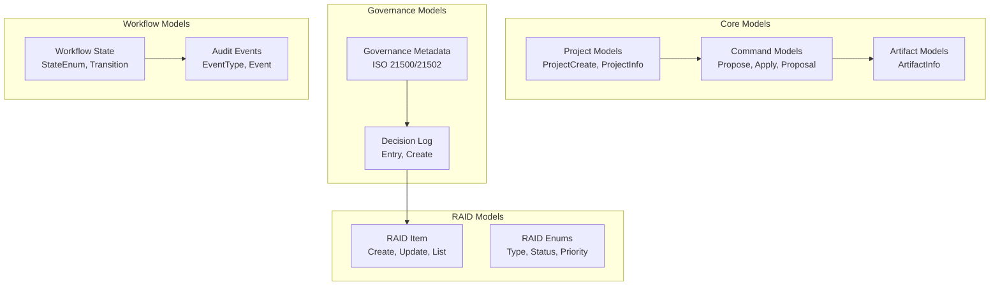

# Data Models and Schemas

**Date:** 2026-01-11  
**Status:** Active  
**Last Updated:** 2026-01-11

## Overview

This document describes the data models and schemas used throughout the AI-Agent-Framework. All API models are defined using Pydantic v2 for validation and serialization. The system uses JSON for persistence with git-based versioning.

## Model Organization

The data models are organized into the following categories:



## Core Models

### 1. Project Models

#### ProjectCreate (Request)

```python
class ProjectCreate(BaseModel):
    key: str  # Pattern: ^[a-zA-Z0-9_-]+$, e.g., "PROJ001"
    name: str  # Human-readable project name
```

**Validation:**
- `key`: Alphanumeric, hyphens, underscores only
- `name`: Required, non-empty

**Example:**
```json
{
  "key": "PROJ001",
  "name": "Digital Transformation Initiative"
}
```

#### ProjectInfo (Response)

```python
class ProjectInfo(BaseModel):
    key: str
    name: str
    methodology: str = "ISO21500"  # Default methodology
    created_at: str  # ISO 8601 timestamp
    updated_at: str  # ISO 8601 timestamp
```

**Example:**
```json
{
  "key": "PROJ001",
  "name": "Digital Transformation Initiative",
  "methodology": "ISO21500",
  "created_at": "2026-01-11T10:00:00Z",
  "updated_at": "2026-01-11T10:00:00Z"
}
```

#### ProjectState (Aggregated Response)

```python
class ProjectState(BaseModel):
    project_info: ProjectInfo
    artifacts: List[Dict[str, Any]]  # List of artifact metadata
    last_commit: Optional[Dict[str, Any]]  # Git commit info
```

**Purpose:** Provides complete project context in single API call

### 2. Command Models

#### CommandPropose (Request)

```python
class CommandPropose(BaseModel):
    command: str  # assess_gaps, generate_artifact, generate_plan
    params: Optional[Dict[str, Any]] = None  # Command-specific parameters
```

**Supported Commands:**
- `assess_gaps` - Analyze missing ISO 21500 artifacts
- `generate_artifact` - Create/update specific artifact (requires `artifact_type` param)
- `generate_plan` - Generate project schedule with Mermaid gantt chart

**Example:**
```json
{
  "command": "generate_artifact",
  "params": {
    "artifact_type": "charter"
  }
}
```

#### FileChange (Diff Representation)

```python
class FileChange(BaseModel):
    path: str  # Relative path within project directory
    operation: str  # "create", "modify", "delete"
    diff: str  # Unified diff format
```

**Example:**
```json
{
  "path": "artifacts/charter.md",
  "operation": "create",
  "diff": "--- /dev/null\n+++ artifacts/charter.md\n@@ -0,0 +1,10 @@\n+# Project Charter\n+..."
}
```

#### CommandProposal (Response)

```python
class CommandProposal(BaseModel):
    proposal_id: str  # UUID for tracking
    assistant_message: str  # Natural language explanation
    file_changes: List[FileChange]  # All proposed changes
    draft_commit_message: str  # Suggested commit message
```

**Example:**
```json
{
  "proposal_id": "abc123-def456",
  "assistant_message": "I've created a project charter based on ISO 21500...",
  "file_changes": [{...}],
  "draft_commit_message": "[PROJ001] Create project charter"
}
```

#### CommandApply (Request)

```python
class CommandApply(BaseModel):
    proposal_id: str  # Must match existing proposal
```

#### CommandApplyResult (Response)

```python
class CommandApplyResult(BaseModel):
    commit_hash: str  # Git commit SHA
    changed_files: List[str]  # Paths of committed files
    message: str  # Confirmation message
```

### 3. Artifact Models

#### ArtifactInfo

```python
class ArtifactInfo(BaseModel):
    path: str  # Relative path
    name: str  # Display name
    type: str  # Artifact type (charter, schedule, etc.)
    versions: List[Dict[str, Any]]  # Git version history
```

**Example:**
```json
{
  "path": "artifacts/charter.md",
  "name": "Project Charter",
  "type": "charter",
  "versions": [
    {
      "commit": "abc123",
      "author": "system",
      "date": "2026-01-11T10:00:00Z",
      "message": "[PROJ001] Create project charter"
    }
  ]
}
```

## Governance Models (ISO 21500/21502)

### 4. Governance Metadata

#### GovernanceMetadata

```python
class GovernanceMetadata(BaseModel):
    objectives: List[str] = []  # Project objectives
    scope: str = ""  # Scope statement
    stakeholders: List[Dict[str, str]] = []  # name, role, responsibilities
    decision_rights: Dict[str, str] = {}  # decision_type -> role
    stage_gates: List[Dict[str, Any]] = []  # name, date, criteria
    approvals: List[Dict[str, Any]] = []  # authority, type, required
    created_at: Optional[str] = None
    updated_at: Optional[str] = None
    created_by: str = "system"
    updated_by: str = "system"
```

**Example:**
```json
{
  "objectives": [
    "Modernize legacy systems",
    "Reduce operational costs by 30%"
  ],
  "scope": "Full digital transformation covering all business units",
  "stakeholders": [
    {
      "name": "John Doe",
      "role": "Project Manager",
      "responsibilities": "Overall delivery and team coordination"
    }
  ],
  "decision_rights": {
    "architecture": "Tech Lead",
    "budget": "CFO",
    "scope": "Steering Committee"
  },
  "stage_gates": [
    {
      "name": "Design Complete",
      "date": "2026-02-01",
      "criteria": ["Architecture approved", "Budget confirmed"]
    }
  ]
}
```

#### GovernanceMetadataUpdate (Request)

All fields optional, only provided fields are updated:

```python
class GovernanceMetadataUpdate(BaseModel):
    objectives: Optional[List[str]] = None
    scope: Optional[str] = None
    stakeholders: Optional[List[Dict[str, str]]] = None
    decision_rights: Optional[Dict[str, str]] = None
    stage_gates: Optional[List[Dict[str, Any]]] = None
    approvals: Optional[List[Dict[str, Any]]] = None
    updated_by: str = "system"
```

### 5. Decision Log Models

#### DecisionLogEntry

```python
class DecisionLogEntry(BaseModel):
    id: str  # Unique decision ID
    title: str
    description: str
    decision_date: str  # ISO 8601
    decision_maker: str  # Person/role
    rationale: str = ""
    impact: str = ""
    status: str = "approved"  # proposed, approved, rejected
    linked_raid_ids: List[str] = []  # Traceability to RAID
    linked_change_requests: List[str] = []
    created_at: Optional[str] = None
    created_by: str = "system"
```

**Example:**
```json
{
  "id": "DEC001",
  "title": "Approve cloud migration strategy",
  "description": "Migrate all services to AWS using lift-and-shift approach",
  "decision_date": "2026-01-15",
  "decision_maker": "CTO",
  "rationale": "Reduce infrastructure costs and improve scalability",
  "impact": "6-month migration timeline, $500K initial investment",
  "status": "approved",
  "linked_raid_ids": ["RISK001", "DEP001"],
  "created_at": "2026-01-11T10:00:00Z"
}
```

#### DecisionLogEntryCreate (Request)

```python
class DecisionLogEntryCreate(BaseModel):
    title: str  # min_length=1
    description: str  # min_length=1
    decision_maker: str
    rationale: str = ""
    impact: str = ""
    status: str = "approved"
    linked_raid_ids: List[str] = []
    linked_change_requests: List[str] = []
    created_by: str = "system"
```

## RAID Models

### 6. RAID Enumerations

#### RAIDType

```python
class RAIDType(str, Enum):
    RISK = "risk"
    ASSUMPTION = "assumption"
    ISSUE = "issue"
    DEPENDENCY = "dependency"
```

#### RAIDStatus

```python
class RAIDStatus(str, Enum):
    OPEN = "open"
    IN_PROGRESS = "in_progress"
    MITIGATED = "mitigated"
    CLOSED = "closed"
    ACCEPTED = "accepted"
```

#### RAIDPriority

```python
class RAIDPriority(str, Enum):
    CRITICAL = "critical"
    HIGH = "high"
    MEDIUM = "medium"
    LOW = "low"
```

#### RAIDImpactLevel (for Risks)

```python
class RAIDImpactLevel(str, Enum):
    VERY_HIGH = "very_high"
    HIGH = "high"
    MEDIUM = "medium"
    LOW = "low"
    VERY_LOW = "very_low"
```

#### RAIDLikelihood (for Risks)

```python
class RAIDLikelihood(str, Enum):
    VERY_LIKELY = "very_likely"
    LIKELY = "likely"
    POSSIBLE = "possible"
    UNLIKELY = "unlikely"
    VERY_UNLIKELY = "very_unlikely"
```

### 7. RAID Item Models

#### RAIDItem

```python
class RAIDItem(BaseModel):
    id: str
    type: RAIDType
    title: str
    description: str
    status: RAIDStatus = RAIDStatus.OPEN
    owner: str
    priority: RAIDPriority = RAIDPriority.MEDIUM
    impact: Optional[RAIDImpactLevel] = None  # Primarily for risks
    likelihood: Optional[RAIDLikelihood] = None  # Primarily for risks
    mitigation_plan: str = ""
    next_actions: List[str] = []
    linked_decisions: List[str] = []  # Decision IDs
    linked_change_requests: List[str] = []
    created_at: str
    updated_at: str
    created_by: str = "system"
    updated_by: str = "system"
    target_resolution_date: Optional[str] = None
```

**Example (Risk):**
```json
{
  "id": "RISK001",
  "type": "risk",
  "title": "Database migration complexity",
  "description": "Legacy system migration may encounter data integrity issues",
  "status": "open",
  "owner": "DBA Team",
  "priority": "high",
  "impact": "high",
  "likelihood": "possible",
  "mitigation_plan": "Comprehensive testing environment with rollback strategy",
  "next_actions": [
    "Create test environment",
    "Document rollback procedures",
    "Schedule dry run"
  ],
  "linked_decisions": ["DEC002"],
  "created_at": "2026-01-11T10:00:00Z",
  "updated_at": "2026-01-11T10:00:00Z",
  "target_resolution_date": "2026-02-01"
}
```

#### RAIDItemCreate (Request)

```python
class RAIDItemCreate(BaseModel):
    type: RAIDType
    title: str  # min_length=1
    description: str  # min_length=1
    status: RAIDStatus = RAIDStatus.OPEN
    owner: str
    priority: RAIDPriority = RAIDPriority.MEDIUM
    impact: Optional[RAIDImpactLevel] = None
    likelihood: Optional[RAIDLikelihood] = None
    mitigation_plan: str = ""
    next_actions: List[str] = []
    linked_decisions: List[str] = []
    linked_change_requests: List[str] = []
    created_by: str = "system"
    target_resolution_date: Optional[str] = None
```

#### RAIDItemUpdate (Request)

All fields optional for partial updates:

```python
class RAIDItemUpdate(BaseModel):
    title: Optional[str] = None
    description: Optional[str] = None
    status: Optional[RAIDStatus] = None
    owner: Optional[str] = None
    priority: Optional[RAIDPriority] = None
    impact: Optional[RAIDImpactLevel] = None
    likelihood: Optional[RAIDLikelihood] = None
    mitigation_plan: Optional[str] = None
    next_actions: Optional[List[str]] = None
    linked_decisions: Optional[List[str]] = None
    linked_change_requests: Optional[List[str]] = None
    updated_by: str = "system"
    target_resolution_date: Optional[str] = None
```

#### RAIDItemList (Response)

```python
class RAIDItemList(BaseModel):
    items: List[RAIDItem]
    total: int
    filtered_by: Optional[Dict[str, Any]] = None
```

## Workflow Models

### 8. Workflow State Models

#### WorkflowStateEnum

```python
class WorkflowStateEnum(str, Enum):
    INITIATING = "initiating"  # Project initiation phase
    PLANNING = "planning"      # Planning phase
    EXECUTING = "executing"    # Execution phase
    MONITORING = "monitoring"  # Monitoring & control phase
    CLOSING = "closing"        # Closing phase
    CLOSED = "closed"          # Project closed
```

**Allowed Transitions (ISO 21500 aligned):**
- `initiating` → `planning`
- `planning` → `executing`
- `executing` → `monitoring`
- `monitoring` → `executing` (iteration)
- `executing` → `closing`
- `closing` → `closed`

#### WorkflowTransition

```python
class WorkflowTransition(BaseModel):
    from_state: WorkflowStateEnum
    to_state: WorkflowStateEnum
    timestamp: str  # ISO 8601
    actor: str = "system"
    reason: Optional[str] = None
```

#### WorkflowStateUpdate (Request)

```python
class WorkflowStateUpdate(BaseModel):
    to_state: WorkflowStateEnum
    actor: str = "system"
    reason: Optional[str] = None
```

#### WorkflowStateInfo (Response)

```python
class WorkflowStateInfo(BaseModel):
    current_state: WorkflowStateEnum
    previous_state: Optional[WorkflowStateEnum] = None
    transition_history: List[WorkflowTransition] = []
    updated_at: str
    updated_by: str = "system"
```

### 9. Audit Event Models

#### AuditEventType

```python
class AuditEventType(str, Enum):
    PROJECT_CREATED = "project_created"
    PROJECT_UPDATED = "project_updated"
    WORKFLOW_STATE_CHANGED = "workflow_state_changed"
    GOVERNANCE_METADATA_CREATED = "governance_metadata_created"
    GOVERNANCE_METADATA_UPDATED = "governance_metadata_updated"
    DECISION_CREATED = "decision_created"
    RAID_ITEM_CREATED = "raid_item_created"
    RAID_ITEM_UPDATED = "raid_item_updated"
    ARTIFACT_CREATED = "artifact_created"
    ARTIFACT_UPDATED = "artifact_updated"
    COMMAND_PROPOSED = "command_proposed"
    COMMAND_APPLIED = "command_applied"
```

#### AuditEvent

```python
class AuditEvent(BaseModel):
    event_id: str  # Unique event UUID
    event_type: AuditEventType
    timestamp: str  # ISO 8601
    actor: str = "system"  # User or system identifier
    correlation_id: Optional[str] = None  # Request tracing
    project_key: str
    payload_summary: Dict[str, Any] = {}  # Non-sensitive summary
    resource_hash: Optional[str] = None  # Hash for compliance
```

**Privacy by Design:**
- Only hashes stored by default
- Full content logging opt-in via configuration
- Compliant with GDPR and ISO 27001

**Example:**
```json
{
  "event_id": "evt_abc123",
  "event_type": "command_applied",
  "timestamp": "2026-01-11T10:00:00Z",
  "actor": "admin",
  "correlation_id": "req_xyz789",
  "project_key": "PROJ001",
  "payload_summary": {
    "command": "generate_artifact",
    "artifact_type": "charter"
  },
  "resource_hash": "sha256:abc123..."
}
```

#### AuditEventList (Response)

```python
class AuditEventList(BaseModel):
    events: List[AuditEvent]
    total: int
    limit: int
    offset: int
    filtered_by: Optional[Dict[str, Any]] = None
```

## Persistence Formats

### Git-Based JSON Storage

All models are persisted as JSON in the `projectDocs/` git repository:

#### Project Metadata
**File:** `projectDocs/{PROJECT_KEY}/project.json`
```json
{
  "key": "PROJ001",
  "name": "Project Name",
  "methodology": "ISO21500",
  "created_at": "2026-01-11T10:00:00Z",
  "updated_at": "2026-01-11T10:00:00Z"
}
```

#### Governance Metadata
**File:** `projectDocs/{PROJECT_KEY}/governance/metadata.json`
```json
{
  "objectives": [...],
  "scope": "...",
  "stakeholders": [...],
  ...
}
```

#### Decision Log
**File:** `projectDocs/{PROJECT_KEY}/governance/decisions.json`
```json
[
  {
    "id": "DEC001",
    "title": "...",
    ...
  }
]
```

#### RAID Register
**File:** `projectDocs/{PROJECT_KEY}/raid/raid_register.json`
```json
[
  {
    "id": "RISK001",
    "type": "risk",
    ...
  }
]
```

#### Audit Events
**File:** `projectDocs/{PROJECT_KEY}/events/events.ndjson`  
**Format:** Newline-delimited JSON (NDJSON)
```ndjson
{"event_id":"evt1","event_type":"project_created","timestamp":"2026-01-11T10:00:00Z",...}
{"event_id":"evt2","event_type":"command_proposed","timestamp":"2026-01-11T10:05:00Z",...}
```

## Validation Rules

### Common Patterns

1. **Timestamps:** All timestamps are ISO 8601 format (e.g., `2026-01-11T10:00:00Z`)
2. **IDs:** Generated as UUIDs or sequential (e.g., `RISK001`, `DEC001`)
3. **Actor/User:** String identifier, defaults to `"system"`
4. **Optional Fields:** Use `Optional[]` with `None` default
5. **Lists:** Default to empty list with `default_factory=list`

### Pydantic Validation

All models use Pydantic v2 features:
- `Field()` for validation constraints
- `min_length`, `max_length` for strings
- `pattern` for regex validation
- Custom validators for complex rules
- Automatic JSON serialization/deserialization

### Error Responses

**Validation Error (422):**
```json
{
  "detail": [
    {
      "type": "string_too_short",
      "loc": ["body", "title"],
      "msg": "String should have at least 1 character",
      "input": ""
    }
  ]
}
```

## Migration and Versioning

### Schema Evolution

When evolving schemas:
1. **Add optional fields** - Backward compatible
2. **Deprecate fields** - Mark in docs, remove after grace period
3. **Breaking changes** - Version API endpoints (e.g., `/api/v2/`)

### Data Migration

Git history preserves all schema versions. Migration handled by:
1. Read old format
2. Transform to new format
3. Write new format
4. Git commit with migration note

## Related Documentation

- [Module Architecture](modules.md) - How models are used across modules
- [Extensibility Guide](extensibility.md) - Adding new models
- [API Integration Guide](../api/client-integration-guide.md) - Using models in API calls
- [Architecture Overview](overview.md) - High-level system design

---

**Last Updated:** 2026-01-11  
**Maintained By:** Development Team  
**Status:** Active
