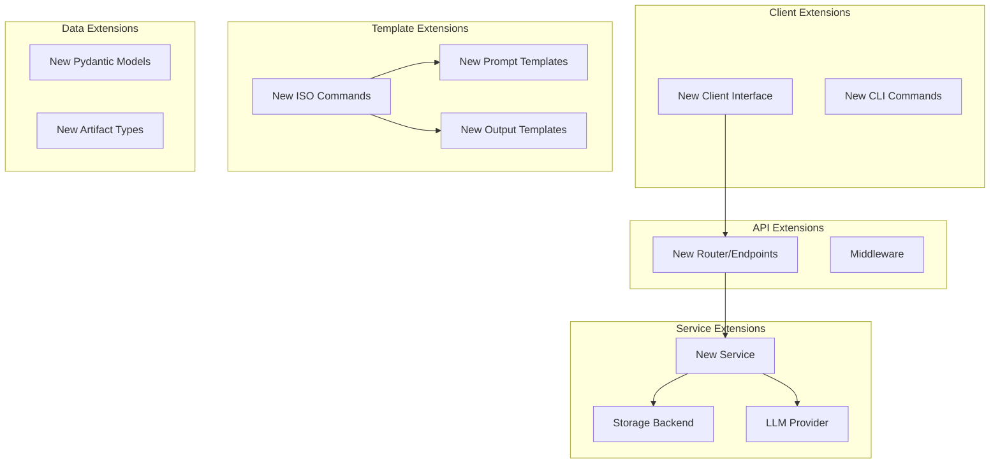

# Extensibility and Contribution Guide

**Date:** 2026-01-11  
**Status:** Active  
**Last Updated:** 2026-01-11

## Overview

This document describes how to extend the AI-Agent-Framework with new features, commands, storage backends, and integrations. It provides clear extension points for contributors and guidelines for maintaining clean architecture.

## Extension Points Overview



## 1. Adding New Commands

### Command Extension Architecture

Commands follow a template-driven pattern with LLM integration:

1. **Add Prompt Template** - `templates/prompts/iso21500/{command}.j2`
2. **Add Output Template** - `templates/output/iso21500/{command}.md`
3. **Register Command** - Update `CommandService.propose_command()`
4. **Add Tests** - Unit and integration tests

### Step-by-Step: Add New Command

**Example:** Add a `generate_risk_assessment` command

#### Step 1: Create Prompt Template

**File:** `templates/prompts/iso21500/generate_risk_assessment.j2`

```jinja2
You are an AI assistant helping with ISO 21500 project management.

Generate a comprehensive risk assessment for the following project:

**Project Key:** {{ project_key }}
**Project Name:** {{ project_name }}

**Existing Artifacts:**

- {{ artifact.path }}


**RAID Register:**


- [{{ item.type|upper }}] {{ item.title }} (Priority: {{ item.priority }})


No RAID items yet.


Please create a risk assessment document that includes:
1. Risk identification methodology
2. Risk analysis (impact and likelihood)
3. Risk prioritization
4. Risk response strategies
5. Risk monitoring plan

Format the output as professional Markdown following ISO 21500 standards.
```

#### Step 2: Create Fallback Template

**File:** `templates/output/iso21500/generate_risk_assessment.md`

```markdown
# Risk Assessment

**Project:** {{ project_name }} ({{ project_key }})  
**Date:** {{ current_date }}

## 1. Risk Identification Methodology

This risk assessment follows ISO 21500 guidelines for project risk management.

## 2. Risk Analysis

| Risk ID | Description | Impact | Likelihood | Score |
|---------|-------------|--------|------------|-------|


| {{ item.id }} | {{ item.title }} | {{ item.impact }} | {{ item.likelihood }} | {{ item.priority }} |



## 3. Risk Prioritization

Critical and high-priority risks require immediate attention and mitigation plans.

## 4. Risk Response Strategies

For each identified risk, develop appropriate response strategies:
- **Avoid:** Eliminate the risk
- **Mitigate:** Reduce probability or impact
- **Transfer:** Shift risk to third party
- **Accept:** Acknowledge and monitor

## 5. Risk Monitoring Plan

Risks should be reviewed weekly during project execution phase.

---

*Generated by AI-Agent-Framework*
```

#### Step 3: Update Command Service

**File:** `apps/api/services/command_service.py`

Add to `propose_command` method:

```python
def propose_command(self, project_key: str, command: str, params: Optional[Dict] = None):
    """Propose a command execution."""
    # ... existing code ...
    
    # Add new command case
    if command == "generate_risk_assessment":
        # Gather context
        project_meta = self.git_manager.get_project_metadata(project_key)
        artifacts = self.git_manager.list_artifacts(project_key)
        
        # Load RAID items if available
        raid_items = []
        try:
            raid_file = self.git_manager.read_file(project_key, "raid/raid_register.json")
            raid_items = json.loads(raid_file) if raid_file else []
        except:
            pass
        
        context = {
            "project_key": project_key,
            "project_name": project_meta.get("name", ""),
            "existing_artifacts": artifacts,
            "raid_items": raid_items,
            "current_date": datetime.now(timezone.utc).isoformat()
        }
        
        # Generate content
        content = self.llm_service.generate("generate_risk_assessment", context)
        
        # Create proposal
        file_changes = [{
            "path": "reports/risk_assessment.md",
            "operation": "create",
            "diff": self._generate_diff("", content)
        }]
        
        # ... rest of proposal creation ...
```

#### Step 4: Add Tests

**File:** `tests/unit/test_command_service.py`

```python
def test_propose_generate_risk_assessment(mock_git_manager, mock_llm_service):
    """Test risk assessment command proposal."""
    service = CommandService(mock_git_manager, mock_llm_service)
    
    # Mock dependencies
    mock_git_manager.get_project_metadata.return_value = {
        "key": "TEST",
        "name": "Test Project"
    }
    mock_llm_service.generate.return_value = "# Risk Assessment\n..."
    
    # Execute
    proposal = service.propose_command("TEST", "generate_risk_assessment")
    
    # Verify
    assert proposal["proposal_id"] is not None
    assert len(proposal["file_changes"]) == 1
    assert proposal["file_changes"][0]["path"] == "reports/risk_assessment.md"
    mock_llm_service.generate.assert_called_once()
```

**File:** `tests/integration/test_commands_api.py`

```python
def test_risk_assessment_end_to_end(client, test_project):
    """Test complete risk assessment workflow."""
    # Propose
    response = client.post(
        f"/projects/{test_project}/commands/propose",
        json={"command": "generate_risk_assessment"}
    )
    assert response.status_code == 200
    proposal = response.json()
    
    # Apply
    response = client.post(
        f"/projects/{test_project}/commands/apply",
        json={"proposal_id": proposal["proposal_id"]}
    )
    assert response.status_code == 200
    
    # Verify file exists
    response = client.get(f"/projects/{test_project}/artifacts/reports/risk_assessment.md")
    assert response.status_code == 200
```

#### Step 5: Update Documentation

Add command to `README.md` and API docs:

```markdown
### Available Commands

- `assess_gaps` - Analyze missing ISO 21500 artifacts
- `generate_artifact` - Create/update specific artifact
- `generate_plan` - Generate project schedule with gantt chart
- `generate_risk_assessment` - Create comprehensive risk assessment ✨ NEW
```

## 2. Adding New API Endpoints

### Router Extension Pattern

Follow FastAPI best practices:

1. **Create New Router** - `apps/api/routers/{domain}.py`
2. **Create Service** - `apps/api/services/{domain}_service.py`
3. **Add Models** - Update `apps/api/models.py`
4. **Register Router** - Update `apps/api/main.py`
5. **Add Tests** - Unit and integration tests

### Step-by-Step: Add Resource Management Endpoints

**Example:** Add `/resources` endpoints for team member management

#### Step 1: Define Models

**File:** `apps/api/models.py`

```python
class ResourceRole(str, Enum):
    """Resource role types."""
    PROJECT_MANAGER = "project_manager"
    DEVELOPER = "developer"
    TESTER = "tester"
    ANALYST = "analyst"

class Resource(BaseModel):
    """Team resource/member."""
    id: str
    name: str
    email: str
    role: ResourceRole
    allocation: float = Field(ge=0.0, le=1.0, description="Allocation percentage (0.0-1.0)")
    skills: List[str] = Field(default_factory=list)
    created_at: str
    updated_at: str

class ResourceCreate(BaseModel):
    """Create resource request."""
    name: str = Field(min_length=1)
    email: str = Field(pattern=r"^[\w\.-]+@[\w\.-]+\.\w+$")
    role: ResourceRole
    allocation: float = Field(default=1.0, ge=0.0, le=1.0)
    skills: List[str] = Field(default_factory=list)
```

#### Step 2: Create Service

**File:** `apps/api/services/resource_service.py`

```python
from typing import List, Optional
import json
import uuid
from datetime import datetime, timezone

class ResourceService:
    """Service for managing project resources."""
    
    def __init__(self, git_manager):
        self.git_manager = git_manager
    
    def create_resource(self, project_key: str, data: dict) -> dict:
        """Create a new resource."""
        # Generate ID
        resource_id = f"RES{str(uuid.uuid4())[:8].upper()}"
        
        # Build resource object
        now = datetime.now(timezone.utc).isoformat()
        resource = {
            "id": resource_id,
            **data,
            "created_at": now,
            "updated_at": now
        }
        
        # Load existing resources
        resources = self._load_resources(project_key)
        resources.append(resource)
        
        # Save
        self._save_resources(project_key, resources)
        
        return resource
    
    def list_resources(self, project_key: str) -> List[dict]:
        """List all resources for a project."""
        return self._load_resources(project_key)
    
    def _load_resources(self, project_key: str) -> List[dict]:
        """Load resources from git."""
        try:
            content = self.git_manager.read_file(project_key, "resources/resources.json")
            return json.loads(content) if content else []
        except:
            return []
    
    def _save_resources(self, project_key: str, resources: List[dict]):
        """Save resources to git."""
        content = json.dumps(resources, indent=2)
        self.git_manager.write_file(
            project_key,
            "resources/resources.json",
            content,
            f"[{project_key}] Update resources"
        )
```

#### Step 3: Create Router

**File:** `apps/api/routers/resources.py`

```python
from fastapi import APIRouter, HTTPException, Depends
from typing import List
from models import Resource, ResourceCreate
from services.resource_service import ResourceService
from services.git_manager import GitManager

router = APIRouter()

def get_resource_service() -> ResourceService:
    """Dependency injection for resource service."""
    from main import app
    return ResourceService(app.state.git_manager)

@router.post("", response_model=Resource, status_code=201)
def create_resource(
    project_key: str,
    resource: ResourceCreate,
    service: ResourceService = Depends(get_resource_service)
):
    """Create a new project resource."""
    try:
        result = service.create_resource(project_key, resource.model_dump())
        return result
    except Exception as e:
        raise HTTPException(status_code=500, detail=str(e))

@router.get("", response_model=List[Resource])
def list_resources(
    project_key: str,
    service: ResourceService = Depends(get_resource_service)
):
    """List all project resources."""
    return service.list_resources(project_key)
```

#### Step 4: Register Router

**File:** `apps/api/main.py`

```python
from routers import resources

# ... existing imports ...

app.include_router(
    resources.router,
    prefix="/projects/{project_key}/resources",
    tags=["resources"]
)
```

#### Step 5: Add Tests

**File:** `tests/unit/test_resource_service.py`

```python
def test_create_resource(mock_git_manager):
    """Test resource creation."""
    service = ResourceService(mock_git_manager)
    mock_git_manager.read_file.return_value = None
    
    resource = service.create_resource("TEST", {
        "name": "John Doe",
        "email": "john@example.com",
        "role": "developer",
        "allocation": 1.0
    })
    
    assert resource["id"].startswith("RES")
    assert resource["name"] == "John Doe"
    mock_git_manager.write_file.assert_called_once()
```

## 3. Adding New Storage Backends

The system uses git-based storage by default, but you can add alternative backends.

### Storage Interface

**File:** `apps/api/services/storage_interface.py`

```python
from abc import ABC, abstractmethod
from typing import List, Optional, Dict

class StorageBackend(ABC):
    """Abstract interface for storage backends."""
    
    @abstractmethod
    def create_project(self, key: str, name: str) -> dict:
        """Create a new project."""
        pass
    
    @abstractmethod
    def read_file(self, project_key: str, path: str) -> Optional[str]:
        """Read file content."""
        pass
    
    @abstractmethod
    def write_file(self, project_key: str, path: str, content: str, message: str):
        """Write file content."""
        pass
    
    @abstractmethod
    def list_artifacts(self, project_key: str) -> List[dict]:
        """List project artifacts."""
        pass
```

### Example: S3 Storage Backend

**File:** `apps/api/services/s3_storage.py`

```python
import boto3
import json
from storage_interface import StorageBackend

class S3StorageBackend(StorageBackend):
    """S3-based storage backend."""
    
    def __init__(self, bucket_name: str):
        self.bucket_name = bucket_name
        self.s3 = boto3.client('s3')
    
    def create_project(self, key: str, name: str) -> dict:
        """Create project in S3."""
        project_data = {
            "key": key,
            "name": name,
            "methodology": "ISO21500"
        }
        
        # Write project metadata
        self.s3.put_object(
            Bucket=self.bucket_name,
            Key=f"{key}/project.json",
            Body=json.dumps(project_data, indent=2)
        )
        
        return project_data
    
    def read_file(self, project_key: str, path: str) -> Optional[str]:
        """Read file from S3."""
        try:
            response = self.s3.get_object(
                Bucket=self.bucket_name,
                Key=f"{project_key}/{path}"
            )
            return response['Body'].read().decode('utf-8')
        except:
            return None
    
    def write_file(self, project_key: str, path: str, content: str, message: str):
        """Write file to S3."""
        self.s3.put_object(
            Bucket=self.bucket_name,
            Key=f"{project_key}/{path}",
            Body=content,
            Metadata={"commit_message": message}
        )
    
    # ... implement other methods ...
```

### Configuration

Add storage backend selection via environment variable:

**File:** `.env`

```bash
STORAGE_BACKEND=git  # or 's3', 'azure_blob', etc.
S3_BUCKET_NAME=my-project-docs
```

**File:** `apps/api/main.py`

```python
import os
from services.git_manager import GitManager
from services.s3_storage import S3StorageBackend

@asynccontextmanager
async def lifespan(app: FastAPI):
    """Initialize services with configurable storage."""
    storage_type = os.getenv("STORAGE_BACKEND", "git")
    
    if storage_type == "git":
        docs_path = os.getenv("PROJECT_DOCS_PATH", "/projectDocs")
        storage = GitManager(docs_path)
        storage.ensure_repository()
    elif storage_type == "s3":
        bucket = os.getenv("S3_BUCKET_NAME")
        storage = S3StorageBackend(bucket)
    else:
        raise ValueError(f"Unknown storage backend: {storage_type}")
    
    app.state.storage = storage
    app.state.llm_service = LLMService()
    yield
```

## 4. Adding New LLM Providers

### LLM Provider Interface

The system supports any OpenAI-compatible API. To add custom providers:

#### Option 1: OpenAI-Compatible Endpoint

**File:** `configs/llm.json`

```json
{
  "base_url": "https://api.anthropic.com/v1",
  "api_key": "your-key",
  "model": "claude-3-opus-20240229",
  "max_tokens": 4000,
  "temperature": 0.7
}
```

#### Option 2: Custom LLM Adapter

**File:** `apps/api/services/llm_adapters/custom_provider.py`

```python
class CustomLLMProvider:
    """Custom LLM provider adapter."""
    
    def __init__(self, config: dict):
        self.endpoint = config["endpoint"]
        self.api_key = config["api_key"]
    
    def generate(self, prompt: str, context: dict) -> str:
        """Generate content using custom API."""
        # Implement custom API call
        response = requests.post(
            self.endpoint,
            headers={"Authorization": f"Bearer {self.api_key}"},
            json={"prompt": prompt, **context}
        )
        return response.json()["generated_text"]
```

**File:** `apps/api/services/llm_service.py`

Update to support multiple providers:

```python
def __init__(self):
    config = self._load_config()
    provider_type = config.get("provider", "openai")
    
    if provider_type == "openai":
        self.provider = OpenAIProvider(config)
    elif provider_type == "custom":
        self.provider = CustomLLMProvider(config)
    else:
        raise ValueError(f"Unknown provider: {provider_type}")
```

## 5. Adding New Client Interfaces

### Client Development Guide

To create a new client (e.g., mobile app, VS Code extension):

1. **Use REST API** - All functionality available via API
2. **Implement Core Flows** - Project CRUD, propose/apply, artifacts
3. **Handle Authentication** - API key header (when enabled)
4. **Error Handling** - Parse HTTP status codes and error responses

### Example: Python SDK

**File:** `sdk/python/ai_agent_framework/__init__.py`

```python
import httpx
from typing import Optional, Dict, List

class AIAgentClient:
    """Python SDK for AI-Agent-Framework."""
    
    def __init__(self, base_url: str = "http://localhost:8000", api_key: Optional[str] = None):
        self.base_url = base_url
        self.headers = {}
        if api_key:
            self.headers["X-API-Key"] = api_key
        self.client = httpx.Client(base_url=base_url, headers=self.headers)
    
    def create_project(self, key: str, name: str) -> dict:
        """Create a new project."""
        response = self.client.post("/projects", json={"key": key, "name": name})
        response.raise_for_status()
        return response.json()
    
    def propose_command(self, project_key: str, command: str, params: Optional[Dict] = None) -> dict:
        """Propose a command."""
        response = self.client.post(
            f"/projects/{project_key}/commands/propose",
            json={"command": command, "params": params or {}}
        )
        response.raise_for_status()
        return response.json()
    
    def apply_proposal(self, project_key: str, proposal_id: str) -> dict:
        """Apply a proposal."""
        response = self.client.post(
            f"/projects/{project_key}/commands/apply",
            json={"proposal_id": proposal_id}
        )
        response.raise_for_status()
        return response.json()
    
    # ... more methods ...
```

**Usage:**

```python
from ai_agent_framework import AIAgentClient

client = AIAgentClient(base_url="http://localhost:8000")

# Create project
project = client.create_project("PROJ001", "My Project")

# Generate charter
proposal = client.propose_command("PROJ001", "generate_artifact", {"artifact_type": "charter"})

# Review and apply
result = client.apply_proposal("PROJ001", proposal["proposal_id"])
```

## 6. Adding Custom Middleware

### Authentication Middleware Example

**File:** `apps/api/middleware/auth.py`

```python
from fastapi import Request, HTTPException
from starlette.middleware.base import BaseHTTPMiddleware
import os

class APIKeyMiddleware(BaseHTTPMiddleware):
    """API key authentication middleware."""
    
    async def dispatch(self, request: Request, call_next):
        # Skip auth for health check
        if request.url.path in ["/", "/health"]:
            return await call_next(request)
        
        # Check API key
        api_key = request.headers.get("X-API-Key")
        valid_key = os.getenv("API_KEY")
        
        if not api_key or api_key != valid_key:
            raise HTTPException(status_code=401, detail="Invalid API key")
        
        return await call_next(request)
```

**Register in main.py:**

```python
from middleware.auth import APIKeyMiddleware

app = FastAPI(...)
app.add_middleware(APIKeyMiddleware)
```

## 7. Testing Extensions

### Test Structure

```
tests/
├── unit/                    # Unit tests (isolated)
│   ├── test_new_service.py
│   └── test_new_command.py
├── integration/             # Integration tests (API)
│   ├── test_new_router.py
│   └── test_new_workflow.py
└── e2e/                     # End-to-end tests
    └── test_new_feature.py
```

### Testing Best Practices

1. **Mock external dependencies** (git, LLM, network)
2. **Use isolated test data** (unique project keys)
3. **Test error scenarios** (404, 400, 500 responses)
4. **Verify side effects** (git commits, audit logs)
5. **Test idempotency** (multiple runs = same result)

### Example Test Fixture

**File:** `tests/conftest.py`

```python
import pytest
from fastapi.testclient import TestClient
from unittest.mock import Mock
import tempfile

@pytest.fixture
def test_git_manager():
    """Isolated git manager for tests."""
    with tempfile.TemporaryDirectory() as tmpdir:
        from services.git_manager import GitManager
        git_manager = GitManager(tmpdir)
        git_manager.ensure_repository()
        yield git_manager

@pytest.fixture
def test_project(test_git_manager):
    """Create test project."""
    project = test_git_manager.create_project("TEST001", "Test Project")
    return project["key"]

@pytest.fixture
def client(test_git_manager, test_llm_service):
    """Test API client."""
    from main import app
    app.state.git_manager = test_git_manager
    app.state.llm_service = test_llm_service
    return TestClient(app)
```

## Documentation Requirements

When contributing extensions, update:

1. **README.md** - User-facing feature description
2. **API Docs** - OpenAPI/Swagger annotations
3. **Module Docs** - This file and related architecture docs
4. **CHANGELOG.md** - Version history
5. **Migration Guide** - If breaking changes

## Code Review Checklist

Before submitting PR:

- [ ] All tests passing (unit + integration)
- [ ] Code formatted with black
- [ ] Linted with flake8
- [ ] Documentation updated
- [ ] No secrets in code
- [ ] Error handling added
- [ ] Audit logging included
- [ ] Backward compatibility maintained

## Related Documentation

- [Module Architecture](modules.md) - Understand existing modules
- [Data Models](data-models.md) - Pydantic model patterns
- [Flows](flows.md) - Integration patterns
- [Development Guide](../development.md) - Local setup and workflow

---

**Last Updated:** 2026-01-11  
**Maintained By:** Development Team  
**Status:** Active
