# Interaction Flows and Sequence Diagrams

**Date:** 2026-01-11  
**Status:** Active  
**Last Updated:** 2026-01-11

## Overview

This document provides detailed interaction flows for key operations in the AI-Agent-Framework. Each flow is illustrated with sequence diagrams showing component interactions, data transformations, and decision points.

## Core Flows

### 1. Project Creation Flow

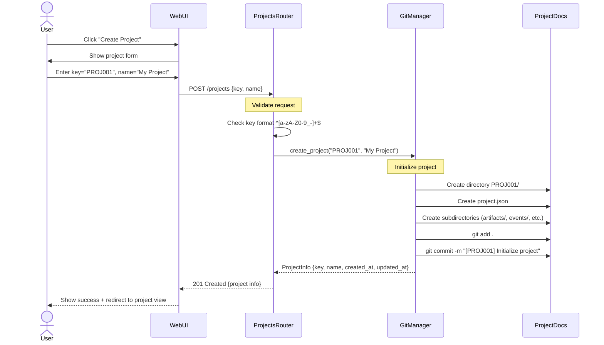

**Key Points:**
- Validation happens at router level (Pydantic models)
- Git operations are atomic (all or nothing)
- Project directory structure created upfront
- Initial commit provides version history baseline

**Error Scenarios:**
- **409 Conflict:** Project key already exists
- **400 Bad Request:** Invalid key format
- **500 Internal Error:** Git operation failed

### 2. Propose/Apply Workflow (with LLM)

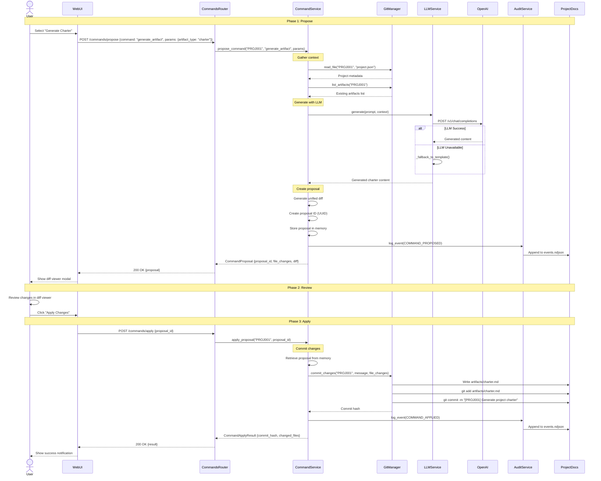

**Key Points:**
- Two-phase workflow: propose → review → apply
- Context gathered from existing project state
- LLM integration with graceful fallback
- All changes committed atomically via git
- Full audit trail of propose and apply events

**Timing:**
- Propose: 1-5 seconds (LLM dependent)
- Apply: <1 second (git operations)

### 3. Governance Decision with RAID Linkage

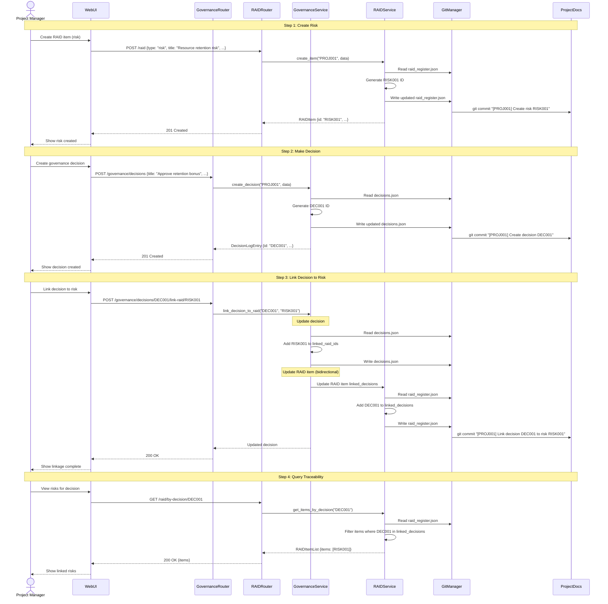

**Key Points:**
- Bidirectional linking (decision ↔ RAID)
- Each operation committed separately
- Traceability maintained in both directions
- Queryable by decision or RAID item

### 4. Workflow State Transition

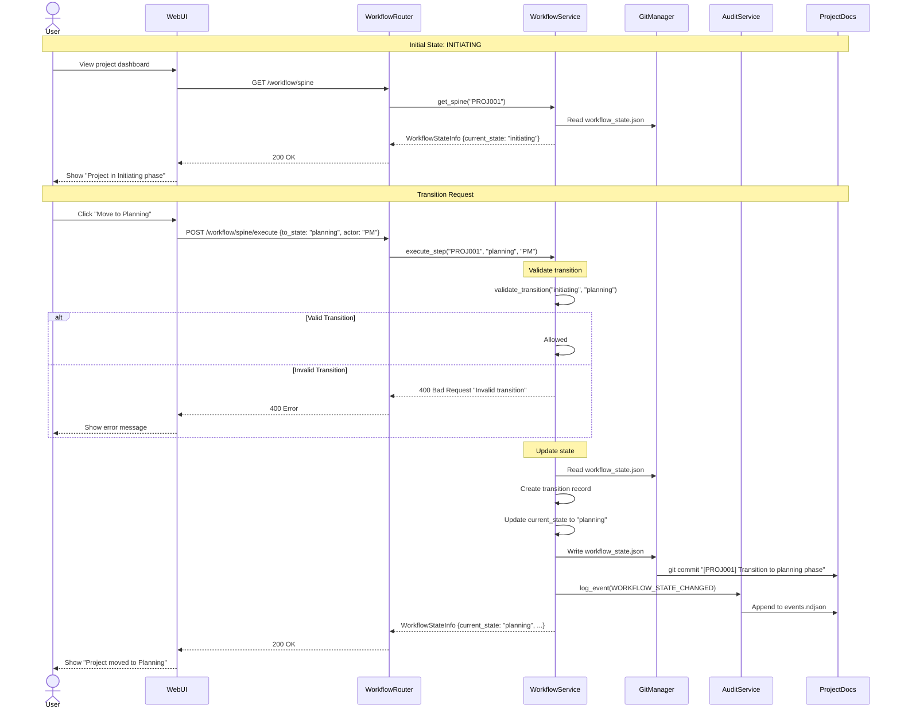

**Key Points:**
- State transitions validated against ISO 21500 rules
- Transition history maintained
- Audit events logged for compliance
- UI reflects new state immediately

**Allowed Transitions:**
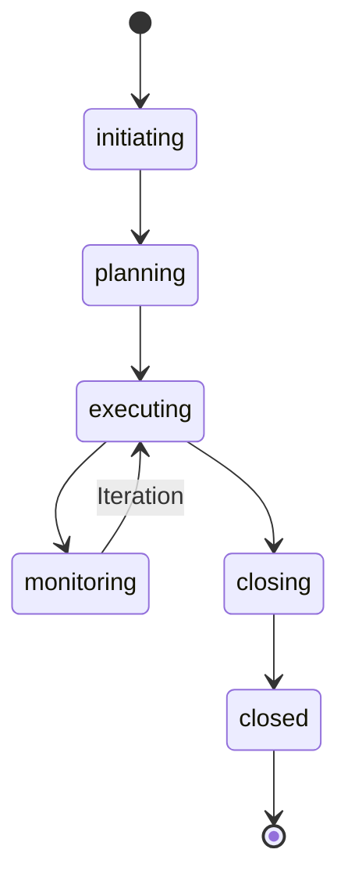

### 5. Artifact Browsing and Retrieval

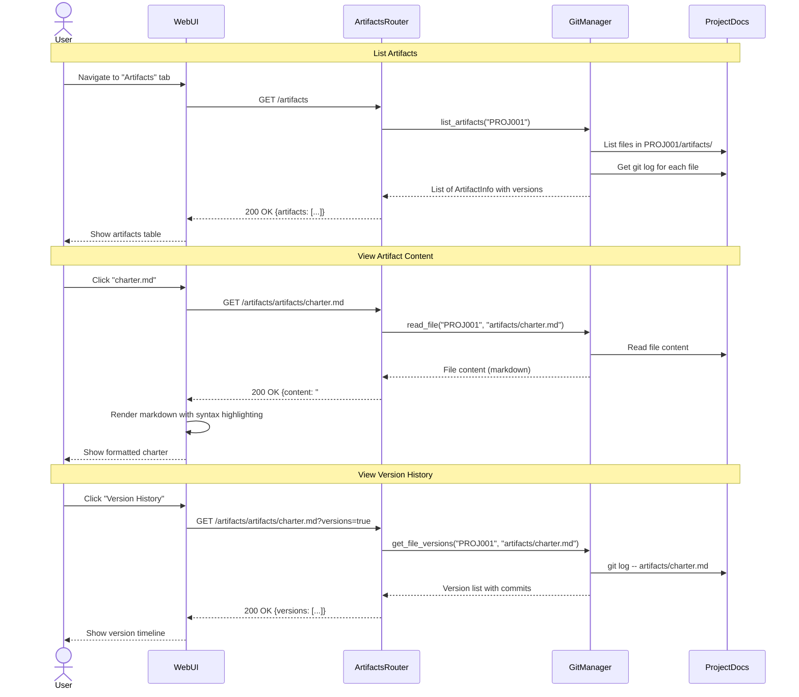

**Key Points:**
- Read-only operations (no mutations)
- Git log provides complete version history
- Markdown rendered in UI with syntax highlighting
- Fast operations (<100ms typical)

### 6. RAID Filtering Workflow

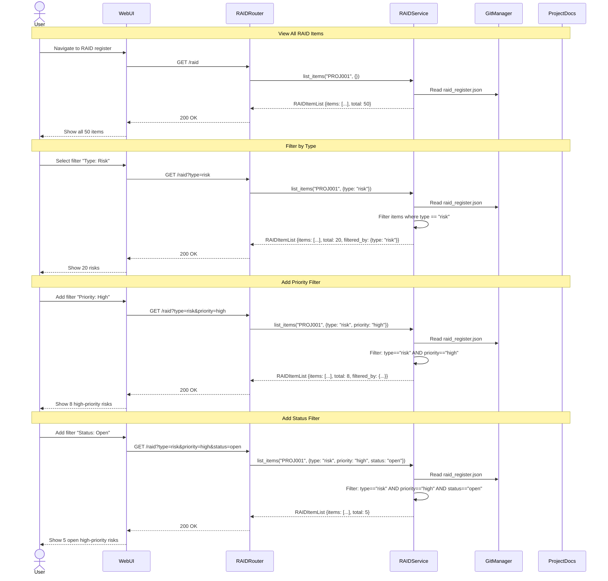

**Supported Filters:**
- `type` - risk, assumption, issue, dependency
- `status` - open, in_progress, mitigated, closed, accepted
- `priority` - critical, high, medium, low
- `owner` - owner name/ID

**Filter Combination:** All filters use AND logic

### 7. Audit Event Retrieval

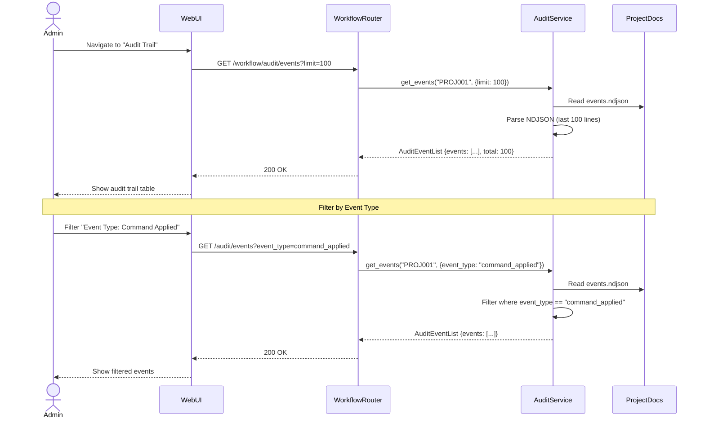

**Key Points:**
- NDJSON format for append-only audit log
- Privacy by design: only hashes stored by default
- Efficient pagination with limit/offset
- Filterable by event type, actor, date range

## Error Handling Flows

### Error Scenario: Proposal Not Found

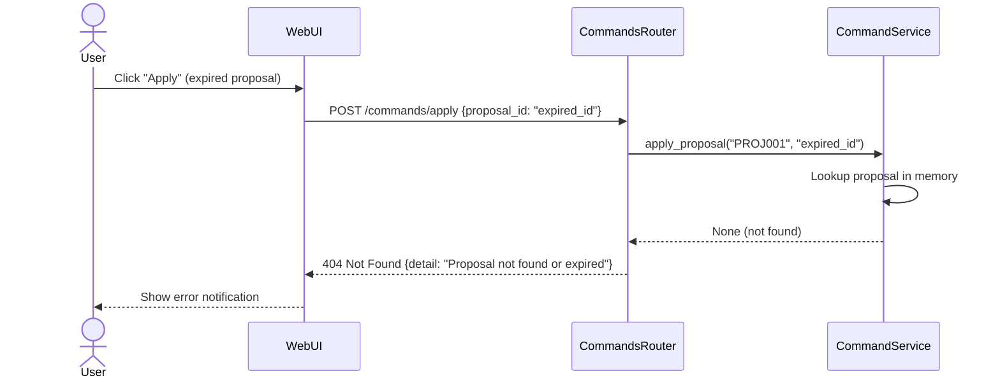

### Error Scenario: Invalid State Transition

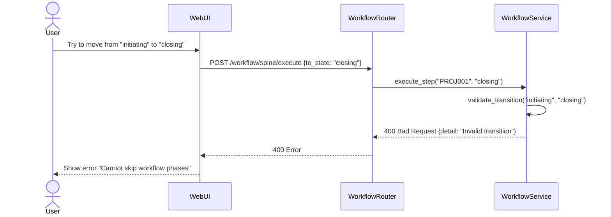

## Performance Optimization

### Caching Strategy

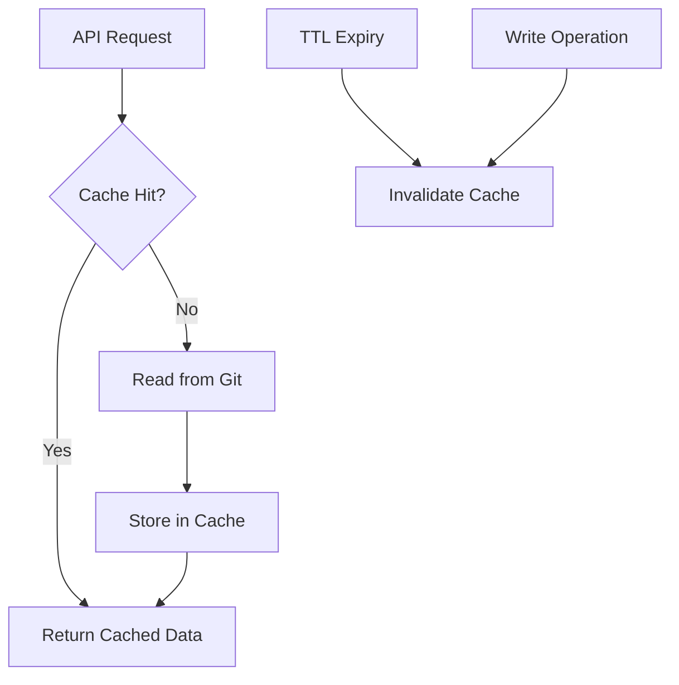

**Cacheable Operations:**
- Project metadata (TTL: 5 minutes)
- Artifact listings (TTL: 1 minute)
- RAID register (invalidate on mutation)

### Async Operations

Long-running operations use async patterns:

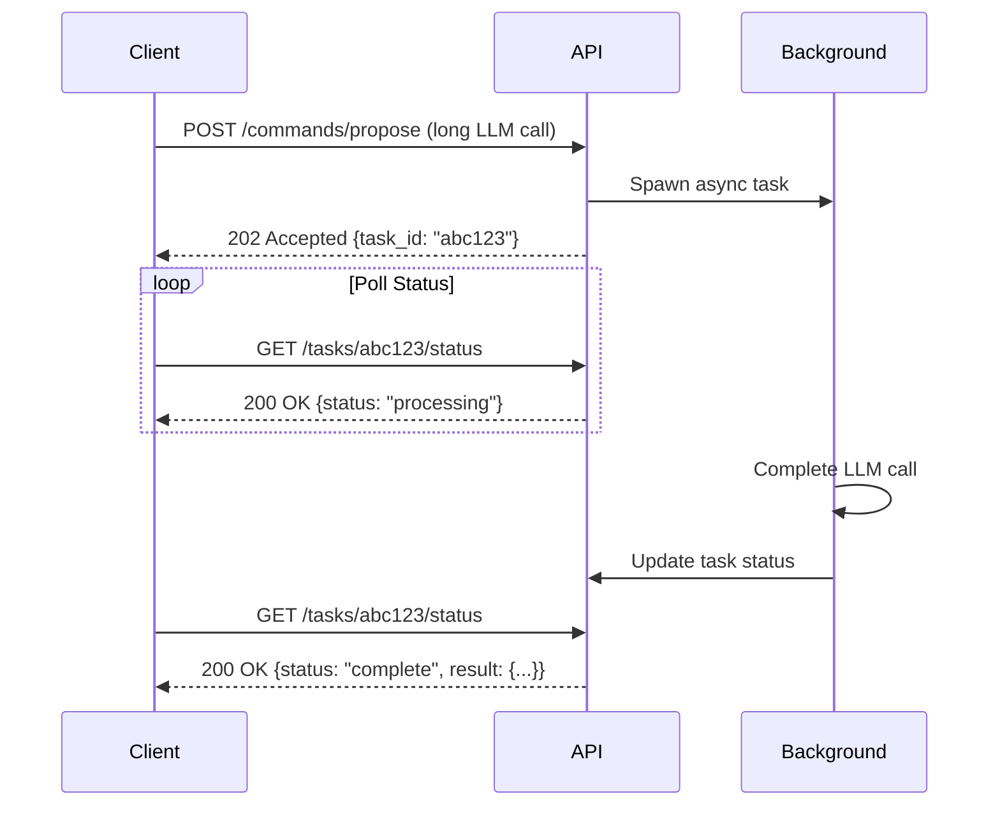

**Note:** Currently not implemented, but planned for future enhancement

## Related Documentation

- [Module Architecture](modules.md) - Component responsibilities
- [Data Models](data-models.md) - Request/response schemas
- [Extensibility Guide](extensibility.md) - Adding new flows
- [API Integration Guide](../api/client-integration-guide.md) - Client implementation

---

**Last Updated:** 2026-01-11  
**Maintained By:** Development Team  
**Status:** Active
