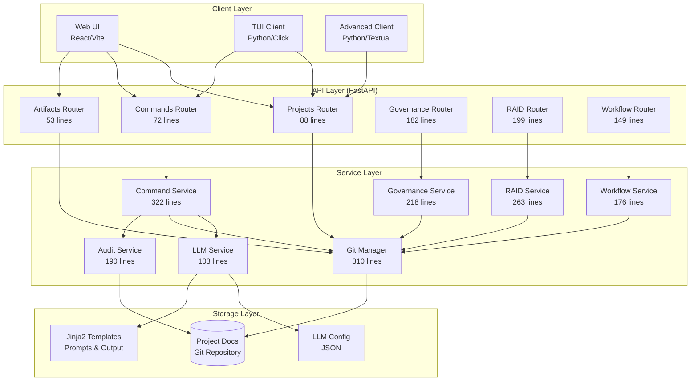
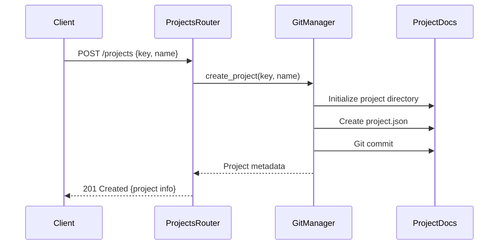
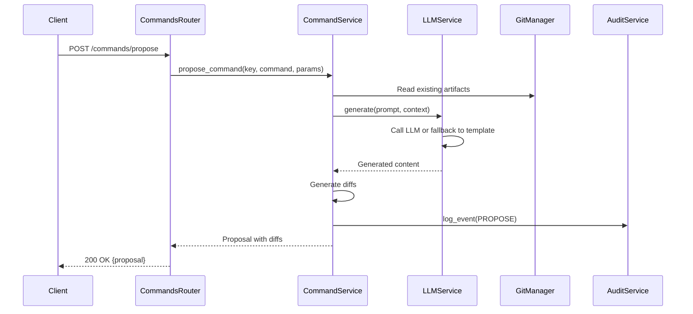
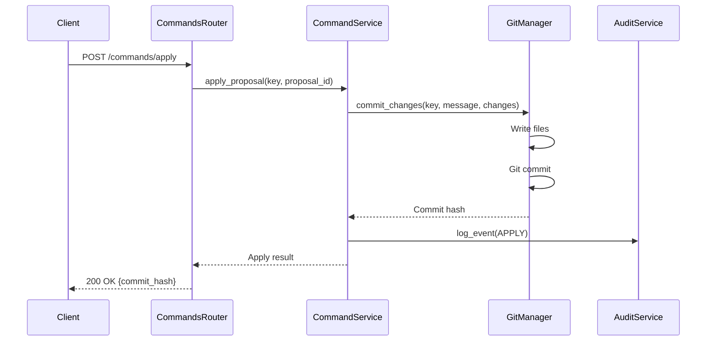
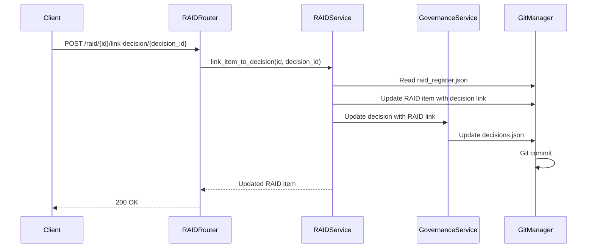

# Module Architecture

**Date:** 2026-01-11  
**Status:** Active  
**Last Updated:** 2026-01-11

## Overview

This document provides a detailed breakdown of the AI-Agent-Framework's module architecture, including responsibilities, boundaries, and interactions. The system follows a clean layered architecture with clear separation of concerns.

## Architecture Diagram



## Module Inventory

### 1. API Layer (Routers)

The API layer provides RESTful HTTP endpoints using FastAPI routers. Each router handles a specific domain and delegates business logic to service layer.

#### 1.1 Projects Router (`routers/projects.py`)

**Lines:** 88  
**Responsibility:** Project lifecycle management  
**Key Endpoints:**
- `POST /projects` - Create new project
- `GET /projects` - List all projects
- `GET /projects/{key}` - Get project details
- `GET /projects/{key}/state` - Get aggregated project state

**Dependencies:**
- `GitManager` - Project persistence and git operations
- Pydantic models - Request/response validation

**Module Boundary:**
- **IN:** HTTP requests with project data
- **OUT:** JSON responses with project information
- **DOES NOT:** Execute git operations directly (delegates to GitManager)

#### 1.2 Commands Router (`routers/commands.py`)

**Lines:** 72  
**Responsibility:** Propose/apply workflow for AI-generated commands  
**Key Endpoints:**
- `POST /projects/{key}/commands/propose` - Generate command proposal
- `POST /projects/{key}/commands/apply` - Apply approved proposal

**Dependencies:**
- `CommandService` - Command execution logic
- Pydantic models - Proposal validation

**Module Boundary:**
- **IN:** Command requests with parameters
- **OUT:** Proposals with diffs or commit results
- **DOES NOT:** Interact with LLM or git directly

#### 1.3 Artifacts Router (`routers/artifacts.py`)

**Lines:** 53  
**Responsibility:** Artifact browsing and retrieval  
**Key Endpoints:**
- `GET /projects/{key}/artifacts` - List project artifacts
- `GET /projects/{key}/artifacts/{path}` - Get artifact content

**Dependencies:**
- `GitManager` - File system operations

**Module Boundary:**
- **IN:** Artifact path requests
- **OUT:** File content or listings
- **DOES NOT:** Modify artifacts (read-only)

#### 1.4 Governance Router (`routers/governance.py`)

**Lines:** 182  
**Responsibility:** ISO 21500/21502 governance backbone  
**Key Endpoints:**
- `GET/POST/PUT /projects/{key}/governance/metadata` - Governance metadata CRUD
- `GET/POST /projects/{key}/governance/decisions` - Decision logging
- `POST /projects/{key}/governance/decisions/{id}/link-raid/{raid_id}` - Link decisions to RAID

**Dependencies:**
- `GovernanceService` - Governance domain logic
- Pydantic models - Governance data validation

**Module Boundary:**
- **IN:** Governance metadata, decisions, linkages
- **OUT:** Governance artifacts and traceability data
- **DOES NOT:** Manage RAID items directly (separate router)

#### 1.5 RAID Router (`routers/raid.py`)

**Lines:** 199  
**Responsibility:** Risk, Assumption, Issue, Dependency register  
**Key Endpoints:**
- `GET /projects/{key}/raid` - List/filter RAID items
- `POST /projects/{key}/raid` - Create RAID item
- `GET/PUT/DELETE /projects/{key}/raid/{id}` - RAID item CRUD
- `POST /projects/{key}/raid/{id}/link-decision/{decision_id}` - Link RAID to decisions

**Dependencies:**
- `RAIDService` - RAID domain logic
- Pydantic models - RAID data validation

**Module Boundary:**
- **IN:** RAID items with filtering criteria
- **OUT:** RAID items and traceability data
- **DOES NOT:** Manage governance decisions directly

#### 1.6 Workflow Router (`routers/workflow.py`)

**Lines:** 149  
**Responsibility:** ISO 21500 workflow spine and audit events  
**Key Endpoints:**
- `GET /api/v1/projects/{key}/workflow/spine` - Get workflow spine
- `POST /api/v1/projects/{key}/workflow/spine/execute` - Execute workflow step
- `GET /api/v1/projects/{key}/workflow/audit/events` - Get audit events
- `POST /api/v1/projects/{key}/workflow/audit/events` - Create audit event

**Dependencies:**
- `WorkflowService` - Workflow domain logic
- `AuditService` - Audit event logging

**Module Boundary:**
- **IN:** Workflow execution requests, audit event data
- **OUT:** Workflow state, audit trails
- **DOES NOT:** Modify project artifacts directly

### 2. Service Layer

The service layer contains business logic and orchestrates operations across multiple concerns.

#### 2.1 Git Manager (`services/git_manager.py`)

**Lines:** 310  
**Responsibility:** Git operations for project document storage  
**Key Methods:**
- `ensure_repository()` - Initialize git repo
- `create_project(key, name)` - Create project with initial commit
- `list_projects()` - Enumerate projects in repository
- `read_file(key, path)` - Read file content
- `write_file(key, path, content)` - Write file with commit
- `list_artifacts(key)` - List project artifacts
- `get_project_metadata(key)` - Load project.json
- `commit_changes(key, message, file_changes)` - Atomic multi-file commit

**Dependencies:**
- `GitPython` library
- File system (projectDocs/)

**Module Boundary:**
- **IN:** Project keys, file paths, content
- **OUT:** File content, commit hashes, metadata
- **DOES NOT:** Know about LLM, commands, or business rules

#### 2.2 LLM Service (`services/llm_service.py`)

**Lines:** 103  
**Responsibility:** LLM integration with graceful fallback  
**Key Methods:**
- `generate(prompt, context)` - Generate content via LLM
- `_call_llm(messages)` - HTTP call to OpenAI-compatible endpoint
- `_fallback_to_template(command, context)` - Template-based generation

**Dependencies:**
- `openai` library (HTTP client)
- Jinja2 templates
- `configs/llm.json` configuration

**Module Boundary:**
- **IN:** Prompts with context
- **OUT:** Generated content (LLM or template)
- **DOES NOT:** Know about git, projects, or persistence

#### 2.3 Command Service (`services/command_service.py`)

**Lines:** 322  
**Responsibility:** Orchestrate propose/apply workflow  
**Key Methods:**
- `propose_command(key, command, params)` - Generate proposal with LLM
- `apply_proposal(key, proposal_id)` - Commit approved changes
- `_generate_diff(old, new)` - Create unified diff
- `_store_audit_event(key, event)` - Log command execution

**Dependencies:**
- `LLMService` - Content generation
- `GitManager` - File operations and commits
- `AuditService` - Event logging

**Module Boundary:**
- **IN:** Command name, parameters, proposal IDs
- **OUT:** Proposals with diffs, commit results
- **DOES NOT:** Expose LLM or git internals

#### 2.4 Governance Service (`services/governance_service.py`)

**Lines:** 218  
**Responsibility:** Governance backbone operations  
**Key Methods:**
- `create_metadata(key, data)` - Create governance metadata
- `get_metadata(key)` - Retrieve metadata
- `update_metadata(key, data)` - Update metadata
- `create_decision(key, data)` - Log governance decision
- `get_decisions(key)` - List decisions
- `link_decision_to_raid(decision_id, raid_id)` - Establish traceability

**Dependencies:**
- `GitManager` - Persistence

**Module Boundary:**
- **IN:** Governance data structures
- **OUT:** Governance artifacts, traceability links
- **DOES NOT:** Manage RAID items (separate service)

#### 2.5 RAID Service (`services/raid_service.py`)

**Lines:** 263  
**Responsibility:** RAID register operations  
**Key Methods:**
- `create_item(key, data)` - Create RAID item
- `get_item(key, item_id)` - Retrieve RAID item
- `update_item(key, item_id, data)` - Update RAID item
- `delete_item(key, item_id)` - Delete RAID item
- `list_items(key, filters)` - List/filter RAID items
- `link_item_to_decision(item_id, decision_id)` - Establish traceability

**Dependencies:**
- `GitManager` - Persistence

**Module Boundary:**
- **IN:** RAID data structures, filters
- **OUT:** RAID items, filtered results
- **DOES NOT:** Manage governance decisions

#### 2.6 Workflow Service (`services/workflow_service.py`)

**Lines:** 176  
**Responsibility:** ISO 21500 workflow spine management  
**Key Methods:**
- `get_spine(key)` - Get workflow spine with states
- `execute_step(key, step_id)` - Execute workflow step
- `validate_transition(from_state, to_state)` - Check state transitions

**Dependencies:**
- `GitManager` - State persistence
- `AuditService` - Event logging

**Module Boundary:**
- **IN:** Workflow step execution requests
- **OUT:** Workflow state changes
- **DOES NOT:** Execute commands directly

#### 2.7 Audit Service (`services/audit_service.py`)

**Lines:** 190  
**Responsibility:** Audit event logging with privacy by design  
**Key Methods:**
- `log_event(key, event_type, data, user)` - Log audit event
- `get_events(key, filters)` - Retrieve audit trail
- `_hash_content(content)` - Hash sensitive data

**Dependencies:**
- `GitManager` - NDJSON persistence

**Module Boundary:**
- **IN:** Event data with optional sensitive content
- **OUT:** Audit trail (hashes by default)
- **DOES NOT:** Modify project artifacts

### 3. Storage Layer

#### 3.1 Project Documents Git Repository

**Location:** `projectDocs/` (separate git repo)  
**Structure:**
```
projectDocs/
├── .git/
└── {PROJECT_KEY}/
    ├── project.json          # Project metadata
    ├── artifacts/            # ISO 21500 artifacts
    │   ├── charter.md
    │   ├── schedule.md
    │   └── ...
    ├── reports/              # Assessment reports
    │   └── gaps.json
    ├── events/               # Audit logs
    │   └── events.ndjson
    ├── governance/           # Governance artifacts
    │   ├── metadata.json
    │   └── decisions.json
    └── raid/                 # RAID register
        └── raid_register.json
```

**Access:** Only through `GitManager` service  
**Isolation:** Never committed to code repository

#### 3.2 Templates

**Location:** `templates/`  
**Structure:**
```
templates/
├── prompts/iso21500/        # LLM prompts (Jinja2)
│   ├── assess_gaps.j2
│   ├── generate_artifact.j2
│   └── generate_plan.j2
└── output/iso21500/         # Fallback templates
    ├── charter.md
    ├── schedule.md
    └── ...
```

**Access:** Through `LLMService`  
**Purpose:** LLM prompts and fallback content

#### 3.3 Configuration

**Location:** `configs/`  
**Files:**
- `llm.default.json` - Default LLM config (committed)
- `llm.json` - User config (gitignored)

**Access:** Through `LLMService`

## Module Interactions

### Scenario 1: Create Project



### Scenario 2: Propose Command (with LLM)



### Scenario 3: Apply Proposal



### Scenario 4: Link RAID to Decision



## Module Extension Points

See [docs/architecture/extensibility.md](extensibility.md) for detailed extension points and contribution guide.

## Testing Strategy

### Unit Tests
- Mock all external dependencies (GitManager, LLMService)
- Test service logic in isolation
- Focus on business rules and validation

### Integration Tests
- Test router + service interactions
- Use test-isolated git repositories
- Verify API contracts

### E2E Tests
- Test complete workflows through API
- Verify git commits and file changes
- Test with real (but isolated) data

## Performance Considerations

### Bottlenecks
1. **Git operations** - Disk I/O and commit overhead
2. **LLM calls** - Network latency (1-5 seconds)
3. **File reading** - For large artifact listings

### Optimization Strategies
1. **Caching** - Cache project metadata in memory
2. **Async operations** - Use FastAPI async/await
3. **Batch commits** - Combine multiple file changes
4. **LLM streaming** - Stream responses for large content

## Security Boundaries

### Trust Boundaries
1. **Client → API**: Validate all input (Pydantic models)
2. **API → Git**: Sanitize file paths (prevent traversal)
3. **API → LLM**: No secrets in prompts (audit logging)

### Authentication (Future)
- API key validation in middleware
- Project-based access control
- Audit logging with user attribution

## Related Documentation

- [Architecture Overview](overview.md) - High-level system architecture
- [Data Models](data-models.md) - Pydantic models and schemas
- [Extensibility Guide](extensibility.md) - How to extend the system
- [Interaction Flows](flows.md) - Detailed sequence diagrams

---

**Last Updated:** 2026-01-11  
**Maintained By:** Development Team  
**Status:** Active
