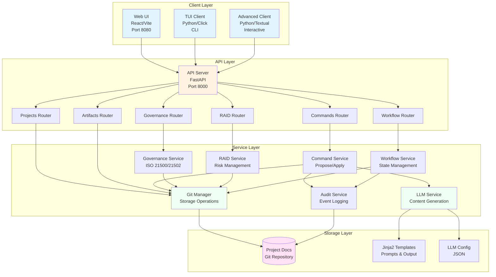

# System Architecture Overview

**Date:** 2026-01-10  
**Status:** Active  
**Last Updated:** 2026-01-10

## Overview

The AI-Agent-Framework is an ISO 21500 Project Management system built with a modern, API-first architecture that separates concerns and enables multiple client interfaces. The system follows a three-container architecture with clear boundaries between the API server, web UI, and command-line clients.

## System Architecture

### High-Level Component Diagram



### Detailed Component Diagram (ASCII)

```
┌─────────────────────────────────────────┐
│         User Interactions               │
└─────────┬───────────────────┬───────────┘
          │                   │
   ┌──────▼──────┐    ┌──────▼──────────┐
   │  TUI Client │    │  WebUI Client   │
   │  (CLI)      │    │  (React/Vite)   │
   └──────┬──────┘    └──────┬──────────┘
          │                   │
          └─────────┬─────────┘
                    │
             ┌──────▼───────┐
             │  API Server  │
             │  (FastAPI)   │
             └──────┬───────┘
                    │
        ┌───────────┼───────────┐
        │           │           │
   ┌────▼────┐ ┌───▼────┐ ┌───▼─────┐
   │ Project │ │  LLM   │ │  Git    │
   │  Docs   │ │Adapter │ │ Ops     │
   │  Repo   │ │        │ │         │
   └─────────┘ └────────┘ └─────────┘
```

### Architecture Layers

#### 1. Client Layer

**WebUI Client** (`apps/web/`)
- **Technology:** React 19.2.0 + Vite (rolldown-vite@7.2.5)
- **Purpose:** Interactive visual interface for project management
- **Port:** 8080 (Docker), 5173 (local dev)
- **Key Features:**
  - Project creation and selection
  - Command execution interface
  - Visual diff viewer for proposals
  - Artifact browser with preview
  - Real-time status updates

**TUI Client** (`apps/tui/`)
- **Technology:** Python 3.10+ with Click framework
- **Purpose:** Command-line interface for automation and scripting
- **Features:**
  - Tightly coupled to API for testing
  - Uses same Python stack as API
  - Enables CI/CD integration
  - Batch operations support

**Legacy Client** (`client/`)
- **Technology:** Python with httpx HTTP client
- **Purpose:** Standalone API consumer demonstrating API-first design
- **Features:**
  - Completely independent from API container
  - Can connect to any API instance
  - Reference implementation for custom clients

#### 2. API Layer

**FastAPI Server** (`apps/api/`)
- **Technology:** Python 3.10+, FastAPI 0.109.1, Uvicorn 0.27.0
- **Port:** 8000
- **Purpose:** Core business logic and REST API endpoints
- **Architecture:**
  - **Routers:** RESTful endpoint handlers
    - `projects.py` - Project CRUD operations
    - `commands.py` - Propose/apply workflow
    - `artifacts.py` - Artifact management
  - **Services:** Business logic layer
    - `git_manager.py` - Git operations for document storage
    - `llm_service.py` - LLM integration with fallback
    - `command_service.py` - Command orchestration
  - **Models:** Pydantic data validation

#### 3. Storage Layer

**Project Documents Repository** (`projectDocs/`)
- **Type:** Separate Git repository
- **Purpose:** Version-controlled document storage
- **Structure:**
  ```
  projectDocs/
  ├── .git/              # Git metadata
  └── {PROJECT_KEY}/     # Per-project folders
      ├── project.json   # Project metadata
      ├── artifacts/     # Generated artifacts
      ├── reports/       # Assessment reports
      └── events/        # Audit logs (NDJSON)
  ```
- **Never committed to code repository** (`.gitignore` exclusion)

**LLM Adapter** (`services/llm_service.py`)
- **Protocol:** OpenAI-compatible HTTP API
- **Configuration:** JSON file (`configs/llm.default.json`)
- **Default:** LM Studio (localhost:1234)
- **Fallback:** Template-based generation when LLM unavailable
- **Privacy:** Configurable endpoints, no forced external sharing

## Repository Structure

### Main Repository: `blecx/AI-Agent-Framework`

Contains the API server and TUI client:

```
AI-Agent-Framework/
├── apps/
│   ├── api/              # FastAPI backend
│   │   ├── main.py       # Application entry point
│   │   ├── models.py     # Pydantic models
│   │   ├── routers/      # API endpoint handlers
│   │   └── services/     # Business logic
│   ├── tui/              # TUI client (tightly coupled)
│   │   └── main.py       # CLI interface
│   └── web/              # React frontend
│       ├── src/
│       │   ├── App.jsx
│       │   ├── components/
│       │   └── services/
│       └── package.json
├── client/               # Legacy standalone client
├── configs/              # Configuration files
│   └── llm.default.json
├── docker/               # Docker build files
│   ├── api/Dockerfile
│   ├── web/Dockerfile
│   └── Dockerfile.tui
├── templates/            # Jinja2 templates
│   ├── prompts/iso21500/
│   └── output/iso21500/
├── docs/                 # Documentation
├── docker-compose.yml    # Container orchestration
└── projectDocs/          # Git repo (excluded from code repo)
```

### Separate Repository: `blecx/AI-Agent-Framework-Client` (Future)

**Note:** Currently, the web UI is in the main repository. A separate client repository is planned for future development with independent versioning.

**Planned Structure:**
```
AI-Agent-Framework-Client/
├── src/
│   ├── App.jsx
│   ├── components/
│   └── services/
├── package.json
├── vite.config.js
└── README.md
```

**Rationale:** See [ADR-0004: Client Separation Strategy](../adr/0004-separate-client-application.md)

## Communication Patterns

### REST API Endpoints

All client communication goes through RESTful HTTP endpoints:

#### Project Management
- `GET /projects` - List all projects
- `POST /projects` - Create new project
- `GET /projects/{key}/state` - Get project state

#### Command Execution (Propose/Apply Pattern)
- `POST /projects/{key}/commands/propose` - Generate command proposal
- `POST /projects/{key}/commands/apply` - Apply approved proposal

#### Artifact Management
- `GET /projects/{key}/artifacts` - List project artifacts
- `GET /projects/{key}/artifacts/{path}` - Get artifact content

#### Health & Status
- `GET /` - Basic health check
- `GET /health` - Detailed health status

### Authentication Flow

**Current (MVP):** No authentication
- Open API for local development
- CORS enabled for all origins

**Future (Production):**
- API key authentication via `X-API-Key` header
- Environment variable configuration
- Rate limiting per API key
- Role-based access control (RBAC)

### Request/Response Formats

**Content Type:** `application/json`

**Standard Request:**
```json
{
  "key": "PROJECT001",
  "name": "Example Project"
}
```

**Standard Response:**
```json
{
  "key": "PROJECT001",
  "name": "Example Project",
  "methodology": "ISO21500",
  "created_at": "2026-01-10T00:00:00Z",
  "updated_at": "2026-01-10T00:00:00Z"
}
```

**Error Response:**
```json
{
  "detail": "Error message description"
}
```

### Error Handling

#### HTTP Status Codes

- `200 OK` - Successful request
- `201 Created` - Resource created successfully
- `400 Bad Request` - Invalid request parameters
- `404 Not Found` - Resource not found
- `409 Conflict` - Resource already exists
- `500 Internal Server Error` - Server error

#### Error Response Structure

All errors return a consistent format:
```json
{
  "detail": "Human-readable error message"
}
```

#### Client Error Handling Best Practices

1. **Check HTTP status codes** before parsing response
2. **Display error.detail** to users
3. **Implement retry logic** for 5xx errors
4. **Validate input** before sending requests
5. **Handle network failures** gracefully

## Deployment Architecture

### Docker Compose (Local Development)

```yaml
services:
  api:           # FastAPI server (port 8000)
  web:           # React/Vite frontend (port 8080)
  client:        # Standalone CLI client (optional)
  tui:           # TUI client (optional)

networks:
  iso21500-network:  # Internal Docker network

volumes:
  projectDocs:       # Mounted from host
```

**Key Features:**
- All containers on same Docker network
- Volume mount for persistent document storage
- API accessible at `http://api:8000` (internal)
- Web UI accessible at `http://localhost:8080` (external)

### Production Deployment Options

#### Option 1: Docker Compose (Single Host)

**Best for:** Small deployments, single server

```bash
# Prepare environment
mkdir -p projectDocs
cp configs/llm.default.json configs/llm.json
# Edit llm.json for production LLM endpoint

# Deploy
docker compose -f docker-compose.prod.yml up -d
```

**Configuration:**
- Use production LLM endpoint in `configs/llm.json`
- Mount projectDocs from persistent storage
- Set environment variables for secrets
- Configure CORS for specific origins

#### Option 2: Kubernetes (Multi-Host)

**Best for:** Large deployments, high availability

**Components:**
- API Deployment + Service
- Web Deployment + Service + Ingress
- PersistentVolumeClaim for projectDocs
- ConfigMap for LLM configuration
- Secrets for API keys

#### Option 3: Separate Hosting

**Best for:** Static web hosting + API server

- **Web UI:** Deploy to Netlify, Vercel, or S3+CloudFront
- **API:** Deploy to AWS ECS, Google Cloud Run, or Azure Container Instances
- **Documents:** Mount persistent volume or use cloud storage

### Networking

#### Internal Communication (Docker Network)

- API ↔ projectDocs: File system access
- Web ↔ API: HTTP via `http://api:8000`
- Client ↔ API: HTTP via `http://api:8000`
- TUI ↔ API: HTTP via `http://api:8000`

#### External Access

- **Development:**
  - Web UI: `http://localhost:8080`
  - API: `http://localhost:8000`
  - API Docs: `http://localhost:8000/docs`

- **Production:**
  - Web UI: `https://your-domain.com`
  - API: `https://api.your-domain.com`
  - API Docs: `https://api.your-domain.com/docs` (restrict access)

#### CORS Configuration

**Development:** Allow all origins (`*`)

**Production:** Specific origins only
```python
allow_origins=[
    "https://your-domain.com",
    "https://www.your-domain.com"
]
```

## Data Flow

### Command Execution Flow (Propose/Apply Pattern)

```
User → WebUI/TUI → API → LLM Service → Templates
                    ↓
              Command Service
                    ↓
              Git Manager
                    ↓
              projectDocs/
```

**Step-by-Step:**

1. **Propose Phase:**
   - User selects command in UI
   - POST `/projects/{key}/commands/propose`
   - Command Service generates proposal using LLM or templates
   - Returns proposal_id, assistant message, file changes, and diffs
   - User reviews changes in UI

2. **Apply Phase:**
   - User approves proposal
   - POST `/projects/{key}/commands/apply`
   - Command Service retrieves cached proposal
   - Git Manager writes files and commits
   - Returns commit hash and changed files
   - UI updates to show new artifacts

### Git Operations Flow

```
Command Service → Git Manager → projectDocs/
                       ↓
                  Git Operations:
                  - Initialize repo
                  - Create project folder
                  - Write files
                  - Stage changes
                  - Commit with message
                  - Append to audit log
```

## Security Architecture

### Secrets Management

**Never Committed:**
- API keys
- LLM endpoints (except defaults)
- Project documents
- User data

**Configuration:**
- Environment variables for secrets
- Mounted configuration files (read-only)
- `.gitignore` excludes sensitive paths

### Audit Logging

**Location:** `projectDocs/{PROJECT_KEY}/events/events.ndjson`

**Format:** NDJSON (newline-delimited JSON)

**Content:**
- Event type and timestamp
- Project key
- Command executed
- File hashes (default, compliance mode)
- Optional: Full content (if enabled)

**Privacy by Design:**
- Only hashes stored by default
- Full content logging requires explicit opt-in
- Audit logs never leave projectDocs repository

### LLM Privacy

- **Configurable endpoints** (local or cloud)
- **Fallback mode** (works without LLM)
- **No forced external data sharing**
- **User controls data flow**

## Technology Stack

### Backend
- **Language:** Python 3.10+
- **Framework:** FastAPI 0.109.1
- **Server:** Uvicorn 0.27.0
- **Validation:** Pydantic 2.5.3
- **Git:** GitPython 3.1.41
- **Templates:** Jinja2 3.1.3
- **LLM Client:** OpenAI SDK 1.10.0

### Frontend
- **Framework:** React 19.2.0
- **Build Tool:** Vite (rolldown-vite@7.2.5)
- **Language:** JavaScript (ES2020+)
- **HTTP Client:** Fetch API
- **Linting:** ESLint 9.39.1

### TUI Client
- **Language:** Python 3.10+
- **Framework:** Click (CLI framework)
- **HTTP Client:** httpx

### Infrastructure
- **Containers:** Docker 28+
- **Orchestration:** Docker Compose
- **Web Server:** nginx (for web UI)
- **Version Control:** Git

## Scalability Considerations

### Current Architecture (MVP)

- Single API instance
- Local file storage
- In-memory proposal cache
- No authentication or rate limiting

### Production Scaling

**Horizontal Scaling:**
- Multiple API instances behind load balancer
- Shared persistent storage for projectDocs
- Redis/Memcached for proposal cache
- Session-based authentication with sticky sessions

**Vertical Scaling:**
- Increase container resources
- Optimize Git operations (shallow clones, partial checkouts)
- LLM response caching

**Database Layer (Future):**
- PostgreSQL for project metadata
- Keep Git for document version control
- Separate concerns: metadata vs. documents

## Monitoring & Observability

### Current (MVP)

- Docker logs: `docker compose logs -f api`
- Health endpoint: `GET /health`
- Manual inspection of projectDocs

### Production Requirements

**Logging:**
- Structured logging (JSON format)
- Centralized log aggregation (ELK, CloudWatch)
- Log levels: DEBUG, INFO, WARNING, ERROR

**Metrics:**
- Request count and latency
- LLM response times
- Git operation duration
- Error rates by endpoint

**Tracing:**
- Distributed tracing (OpenTelemetry)
- Request ID propagation
- End-to-end transaction tracking

**Alerting:**
- Failed API requests
- LLM unavailability
- Git operation failures
- Disk space alerts

## Extension Points

### Adding New Clients

1. **Follow the API contract:** Use REST endpoints only
2. **Implement propose/apply workflow:** Required for proper audit trail
3. **Handle errors gracefully:** Parse error responses
4. **Use API documentation:** See [Client Integration Guide](../api/client-integration-guide.md)

### Adding New Commands

1. **Create prompt template:** `templates/prompts/iso21500/{command}.j2`
2. **Create output template:** `templates/output/iso21500/{command}.md`
3. **Update command service:** Add command logic to `services/command_service.py`
4. **Update UI:** Add command to CommandPanel component

### Custom LLM Adapters

1. **OpenAI-compatible:** Works out of the box
2. **Custom protocol:** Extend `LLMService` class
3. **Fallback required:** Must handle LLM unavailability

## Compliance & Standards

### ISO 21500
- Project management methodology
- Standard artifact templates
- Lifecycle phase tracking

### EU AI Act
- Transparency: Clear separation of components
- Documentation: Comprehensive system documentation
- Human oversight: Propose/apply workflow

### ISO 27001
- Access control: Authentication planned
- Audit trail: Comprehensive logging
- Separation of duties: Client/server architecture

### GDPR
- Data minimization: Hash-only logging by default
- Privacy by design: Local LLM option
- Transparency: Clear data flow documentation

## Related Documentation

- [ADR-0001: Separate Project Documents Repository](../adr/0001-docs-repo-mounted-git.md)
- [ADR-0002: LLM HTTP Adapter with JSON Configuration](../adr/0002-llm-http-adapter-json-config.md)
- [ADR-0003: Propose/Apply Workflow](../adr/0003-propose-apply-before-commit.md)
- [ADR-0004: Client Separation Strategy](../adr/0004-separate-client-application.md)
- [Deployment Guide](../deployment/multi-component-guide.md)
- [Client Integration Guide](../api/client-integration-guide.md)
- [Development Guide](../development.md)
- [MVP Specification](../spec/mvp-iso21500-agent.md)

## Revision History

| Version | Date | Changes | Author |
|---------|------|---------|--------|
| 1.0.0 | 2026-01-10 | Initial architecture documentation | GitHub Copilot |

---

**Classification:** Internal  
**Retention:** Indefinite (architectural documentation)  
**Last Reviewed:** 2026-01-10
