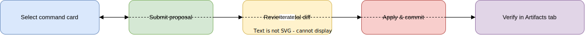
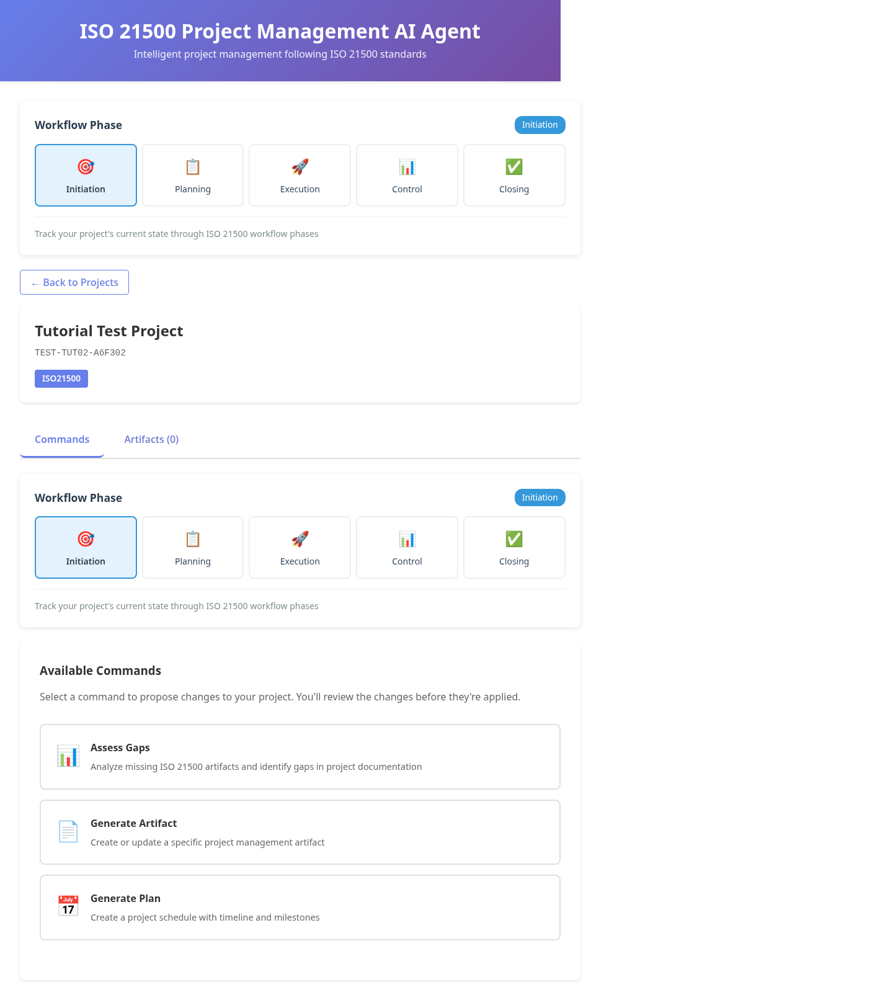
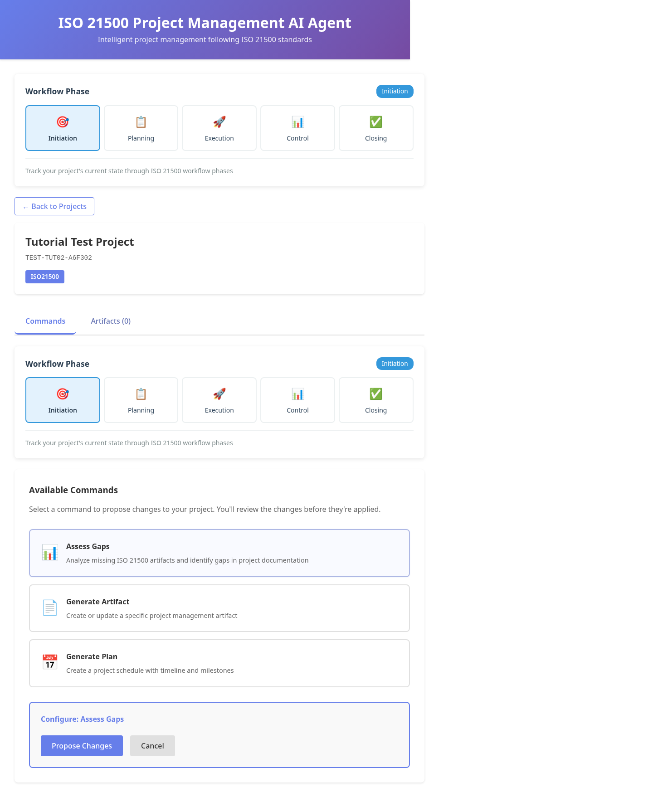
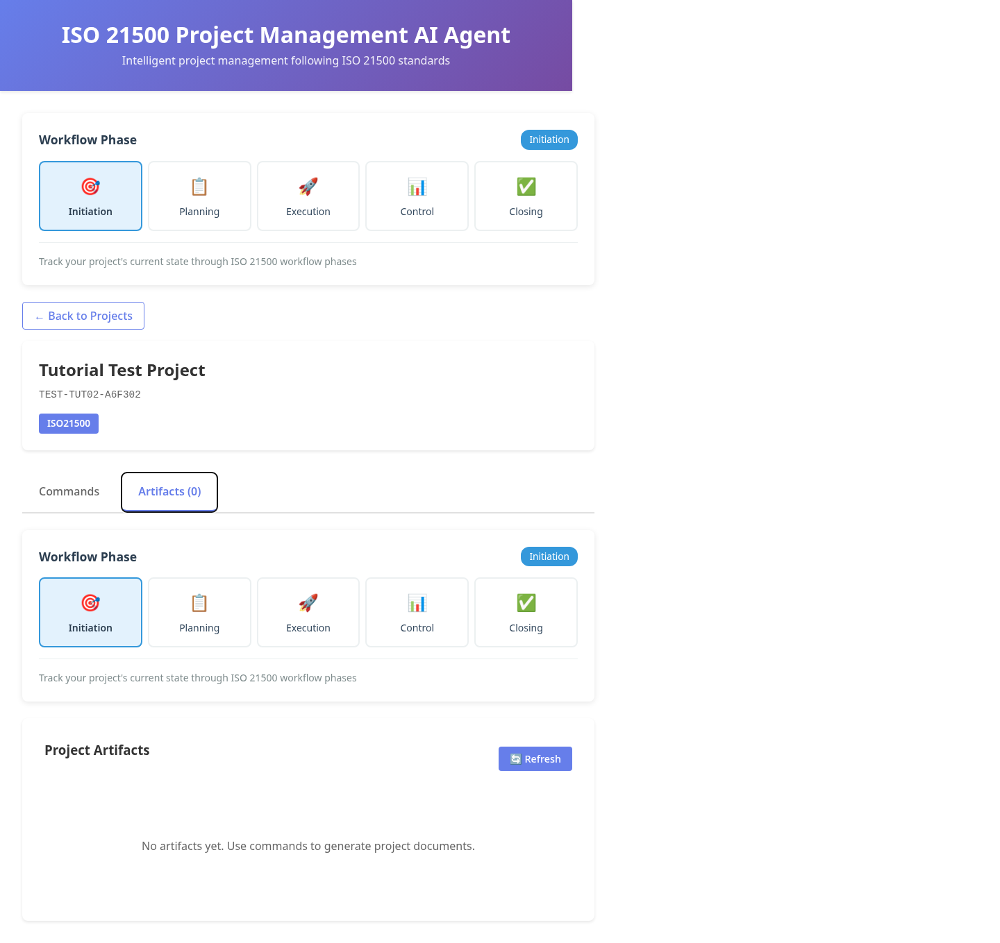

# GUI Commands and Proposals

This page reflects the current shipped Web UI behavior.

## Visual learning map

Use this process map before you begin:



Then follow screenshots in order:

1. Home view: `01-home-overview.png`
2. Commands tab: `02-project-commands-tab.png`
3. Command selection: `03-command-selection.png`
4. Artifacts verification: `04-artifacts-tab.png`

## Available command cards

- `assess_gaps`
- `generate_artifact`
- `generate_plan`

For `generate_artifact`, fill both parameters:

- `artifact_name`
- `artifact_type`

## Guided screenshots

### Step A — Enter project workspace



What to look for:

- project title and key in header
- `Commands` tab active
- three command cards visible

### Step B — Pick command card and set parameters



For `generate_artifact`, fill both parameter inputs before submitting.

### Step C — Verify outcome in artifacts tab



After apply, switch to `Artifacts` tab and confirm your expected file appears.

## Workflow

1. Open project in the web UI.
2. In **Commands** tab, pick a command card.
3. Submit proposal.
4. Review diff in modal.
5. Apply to commit changes.
6. Verify in **Artifacts** tab.

## URL consistency

- Docker web UI: `http://localhost:8080`
- Local dev web UI: `http://localhost:5173`

## Re-generate images for this page

```bash
bash docs/tutorials/scripts/capture-workflow-screenshots.sh
```

For full visual pipeline (draw.io + screenshots):

```bash
bash docs/tutorials/scripts/generate-visual-assets.sh
```

## TUI equivalent

```bash
python apps/tui/main.py commands propose --project TODO-001 --command assess_gaps
python apps/tui/main.py commands apply --project TODO-001 --proposal <proposal-id>
```

---

**Last Updated:** 2026-02-16
