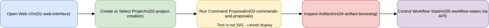
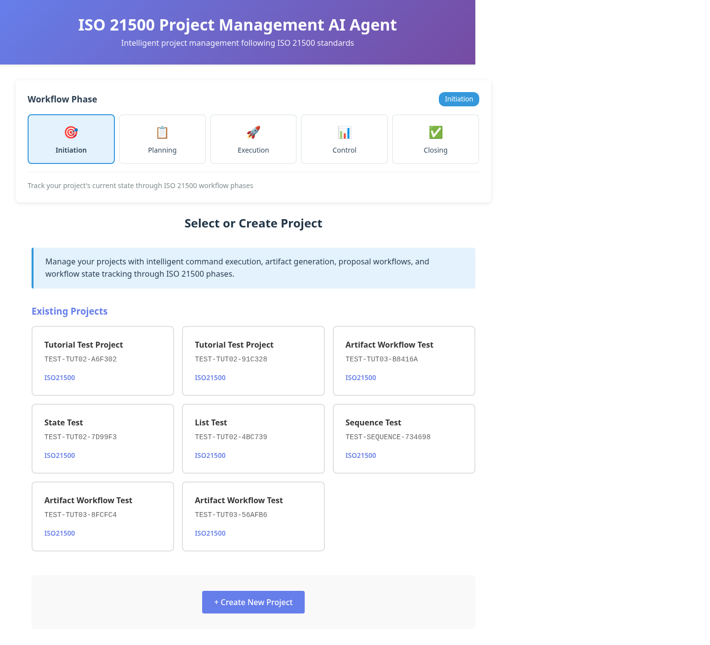

# GUI Workflow States (via API)

The web app shows a **visual phase indicator** (local UI state), while the persisted workflow state is managed through API endpoints.

## Visual learning map



For newcomers, use this order:

1. Commands and proposals in UI
2. Artifact verification in UI
3. Workflow-state read/transition via API calls below

## UI orientation screenshot



Use this screenshot to locate the phase indicator and project workspace entry point.

## Read workflow state

```bash
curl -s http://localhost:8000/projects/TODO-001/workflow/state | jq .
```

## Read allowed transitions

```bash
curl -s http://localhost:8000/projects/TODO-001/workflow/allowed-transitions | jq .
```

## Transition workflow state

```bash
curl -s -X PATCH http://localhost:8000/projects/TODO-001/workflow/state \
  -H "Content-Type: application/json" \
  -d '{"to_state":"executing","actor":"pm","reason":"planning baseline approved"}' | jq .
```

## Supported states and transitions

- initiating → planning
- planning → executing | initiating
- executing → monitoring | planning
- monitoring → executing | closing
- closing → closed

## Versioned equivalents

- `/api/v1/projects/{project_key}/workflow/state`
- `/api/v1/projects/{project_key}/workflow/allowed-transitions`

## Re-generate diagrams/screenshots

```bash
bash docs/tutorials/scripts/export-drawio.sh
bash docs/tutorials/scripts/capture-workflow-screenshots.sh
```

---

**Last Updated:** 2026-02-15
