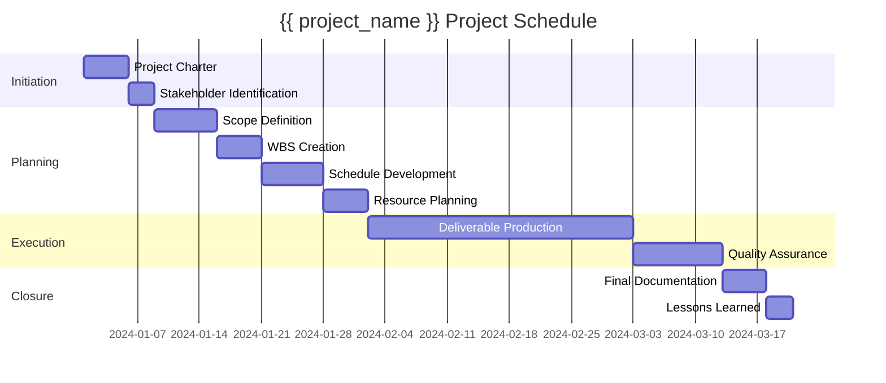

# Project Schedule

**Project:** {{ project_name }}  
**Project Key:** {{ project_key }}  
**Generated:** {{ timestamp }}  
**Standard:** ISO 21500

---

## Schedule Overview

{{ llm_schedule }}

---

## Gantt Chart

---

## Key Milestones

| Milestone | Target Date | Description |
|-----------|------------|-------------|
| Project Kickoff | Week 1 | Project initiation complete |
| Planning Complete | Week 4 | All plans approved |
| Execution Start | Week 5 | Begin deliverable production |
| Quality Review | Week 10 | QA checkpoint |
| Project Closure | Week 12 | Final deliverables and documentation |

---

*This schedule follows ISO 21500 project management standards and should be updated regularly.*
